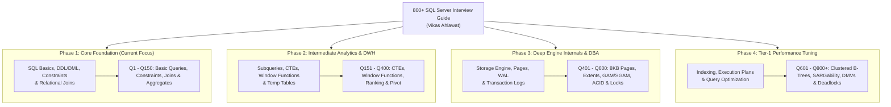

# 📖 800+ SQL SERVER INTERVIEW QUESTIONS — MASTER READING & STRATEGY GUIDE

**Companion Resource:** [800+ SQL Server Interview Question Answers PDF Free by Vikas Ahlawat.pdf](./800+%20SQL%20Server%20Interview%20Question%20Answers%20PDF%20Free%20by%20Vikas%20Ahlawat.pdf)  
**Author:** Vikas Ahlawat (Senior Database Architect & Microsoft SQL Server Community Leader)  
**Target Goal:** 25+ LPA Tier-1 Data Engineer / Database Architect Roles  
**Maintained by:** Pippo 🐥 for Cap (**Captain Arpit Manoj Bangre**)

---

## 🎯 PURPOSE & EXECUTIVE SUMMARY

This master reading guide structures the **800+ SQL Server Interview Questions and Answers** PDF into actionable, topic-aligned study sprints. Instead of reading 800 questions linearly, this guide maps specific chapters and question ranges directly to course milestones, LeetCode patterns, and Tier-1 interview elimination rounds.

---

## 🗺️ MASTER TOPIC MAP & READING PRIORITY MATRIX

---

## 📑 DOMAIN-WISE BREAKDOWN & STUDY CHEAT SHEET

### 🟢 1. Core Architecture, DDL, DML & Constraints (Q1 - Q150)
- **High-Yield Topics:**
  - `DELETE` vs `TRUNCATE` vs `DROP` (DML vs DDL, minimal logging, rollback proofs).
  - Primary Key vs Unique Key (1 NULL allowed in SQL Server UNIQUE constraint).
  - Referential Integrity & Cascading Actions (`ON DELETE CASCADE`, `ON DELETE SET NULL`).
  - Constraint Retrofitting & Data Sanitization rules on live populated tables.
- **Top Interview Trap:**
  - *Can TRUNCATE be rolled back?* -> **YES**, inside an explicit `BEGIN TRANSACTION ... ROLLBACK` in SQL Server because page deallocations are logged in the LDF.

---

### 🟡 2. Relational Joins, Cartesian Products & Set Operators (Q151 - Q300)
- **High-Yield Topics:**
  - ANSI SQL-92 `INNER`, `LEFT`, `RIGHT`, `FULL OUTER` joins vs legacy comma-separated equi-joins.
  - Cartesian Cross Product math (`N x M x P`) and accidental cross-join traps.
  - Three-Valued Logic (3VL) in joins (`NULL = NULL` evaluates to `UNKNOWN`).
  - Set Operators (`UNION`, `UNION ALL`, `INTERSECT`, `EXCEPT`) vs Relational Joins.
  - Physical Join Operators: **Nested Loop Join** (small OLTP), **Merge Join** (pre-sorted keys), **Hash Match Join** (large unsorted Big Data).
- **Top Interview Trap:**
  - *`INTERSECT` vs `INNER JOIN` with duplicates and NULLs* -> `INTERSECT` deduplicates and treats `NULL = NULL` as equal; `INNER JOIN` produces Cartesian duplicate multipliers and ignores `NULL` join keys.

---

### 🟠 3. Advanced Analytics, CTEs & Window Functions (Q301 - Q480)
- **High-Yield Topics:**
  - `ROW_NUMBER()`, `RANK()`, `DENSE_RANK()`, `NTILE()` difference on duplicate values.
  - Analytical Offset Functions: `LEAD()`, `LAG()`, `FIRST_VALUE()`, `LAST_VALUE()`.
  - Cumulative Aggregations: `SUM() OVER(PARTITION BY ... ORDER BY ... ROWS BETWEEN UNBOUNDED PRECEDING AND CURRENT ROW)`.
  - Non-correlated Subqueries vs Correlated Subqueries (`EXISTS` vs `IN`).
  - Common Table Expressions (CTEs) & Recursive CTEs for hierarchical organizational trees.
- **Top Interview Trap:**
  - *`RANK()` vs `DENSE_RANK()` with gap generation* -> `RANK()` produces gaps (1, 2, 2, 4); `DENSE_RANK()` produces no gaps (1, 2, 2, 3).

---

### 🔴 4. Database Engine Internals & Storage (Q481 - Q620)
- **High-Yield Topics:**
  - Data Page Architecture: 8 KB page size, 8-page extents (64 KB Uniform vs Mixed Extents).
  - Page Header (96 bytes), Row Offset Array, GAM (Global Allocation Map), SGAM, PFS.
  - Write-Ahead Logging (WAL) & Transaction Log (`.ldf`) architecture.
  - Checkpoint mechanisms, Dirty Pages, Lazy Writer, and Buffer Pool management.
  - Temporary storage: `#TempTables` (in tempdb, indexed) vs `@TableVariables` (in-memory/tempdb, no statistics) vs `CTEs` (virtual expression).

---

### 🔥 5. Indexing, Query Optimization & Execution Plans (Q621 - Q750)
- **High-Yield Topics:**
  - Clustered Index (data rows stored physically in B-Tree leaf nodes, 1 per table).
  - Non-Clustered Index (leaf nodes store index keys + pointer/RID/clustering key).
  - Covering Indexes with `INCLUDE` clause to prevent expensive Key Lookups / RID Lookups.
  - Index Seek (efficient B-Tree binary traversal) vs Index Scan (reading every page).
  - SARGable queries (Search Argument Able): Avoiding functions on indexed columns in `WHERE` clauses (e.g. `WHERE YEAR(OrderDate) = 2026` is Non-SARGable; `WHERE OrderDate >= '2026-01-01' AND OrderDate < '2027-01-01'` is SARGable).
  - Index Fragmentation & Maintenance: `ALTER INDEX REORGANIZE` (< 30%) vs `ALTER INDEX REBUILD` (> 30%).

---

### ⚡ 6. Concurrency, Transactions & Deadlocks (Q751 - Q800+)
- **High-Yield Topics:**
  - ACID Properties: Atomicity, Consistency, Isolation, Durability.
  - Transaction Isolation Levels:
    1. `READ UNCOMMITTED` (allows Dirty Reads, NOLOCK hint).
    2. `READ COMMITTED` (default, prevents Dirty Reads).
    3. `REPEATABLE READ` (prevents Non-Repeatable Reads, holds shared locks).
    4. `SNAPSHOT` (row-versioning in tempdb, zero read-write blocking).
    5. `SERIALIZABLE` (prevents Phantom Reads using Key-Range locks).
  - Lock Modes: Shared (`S`), Exclusive (`X`), Update (`U`), Intent (`IS`, `IX`).
  - Deadlock handling: Error Msg 1205, Deadlock Graph extraction, `SET DEADLOCK_PRIORITY LOW`.

---

## 🚀 HOW WE INTEGRATE THIS BOOK INTO OUR MASTER ECOSYSTEM

1. **Daily Practice Questions (`05_INDEX_WISE_QUESTIONS/`):**
   - Pippo pulls difficult edge cases directly from this PDF to build Section 4 (Tier-1 Traps) of every practice set.
2. **Weekly Mock Interviews:**
   - Real-time architectural Q&A drills pulled from the Advanced DBA and Performance Tuning chapters.
3. **LinkedIn & Social Presence Posts:**
   - Transforming high-yield SQL traps from this book into engaging technical infographics and LinkedIn carousel posts to establish Cap's domain authority.
