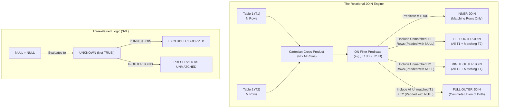

# 📘 DAY 15: FOUNDATIONS OF RELATIONAL JOINS, CARTESIAN PRODUCTS ($N x M$) & NULL MATCHING MECHANICS

**Course:** Data Engineering Master Course  
**Batch:** Online Batch 15 | **Date:** 18 August 2026 (Tuesday)  
**Module 1:** Enterprise SQL Architecture & Query Engine  
**Companion File:** [Join.xlsx](../01_CLASS_NOTES/Join.xlsx)

---

## 🗺️ STEP 1: MIND MAP & HIGH-LEVEL ARCHITECTURE



---

## 📖 STEP 2: VOCABULARY & PLAIN-ENGLISH GLOSSARY

| Difficult Word / Term | Simple Meaning | Real-Life Analogy |
| :--- | :--- | :--- |
| **Relational Join** | Combining columns from two tables horizontally based on a related key column. | Stitching two pages of a passbook side-by-side to see customer name and transaction history together. |
| **Cartesian Cross-Product ($N x M$)** | Generating every possible pairing between every row of Table 1 and every row of Table 2. | A speed-dating event where every single person in Group A introduces themselves to every single person in Group B. |
| **Equi-Join** | A join that uses the equality operator (`=`) in its matching condition (`ON T1.id = T2.id`). | Matching people by comparing if their passport numbers are exactly identical. |
| **Predicate** | A condition or rule in SQL that evaluates to `TRUE`, `FALSE`, or `UNKNOWN`. | The security bouncer at the door checking if your ticket number matches the guest list. |
| **Three-Valued Logic (3VL)** | SQL's truth system: `TRUE`, `FALSE`, and `UNKNOWN`. | A light switch with three states: ON, OFF, and DISCONNECTED / MISSING WIRE. |
| **Outer Padding** | Filling non-matching columns with `NULL` values when unmatched rows are kept. | Leaving empty blank lines on a government form when an optional spouse field does not apply to you. |
| **String Literal `'NULL'`** | Actual text characters `'N'`, `'U'`, `'L'`, `'L'` enclosed in quotes. | A name tag that literally has the word "NULL" printed in black ink. |
| **SQL Keyword `NULL`** | A special database marker meaning "no data exists" or "unknown value". | A completely blank sticker where no one has written anything yet. |

---

## 🧠 STEP 3: CORE CONCEPTS & RELATIONAL MECHANICS

### 1. The Core Relational Equation
Many beginners mistakenly think of SQL JOINS as simple Venn diagrams. In reality, a database engine processes a join in two sequential mechanical steps:

`RELATIONAL JOIN = (Cartesian Cross-Product N x M) -> (Apply Filter Predicate ON T1.K = T2.K)`

### 2. Primary Join Taxonomy

1. **INNER JOIN:**
   - Evaluates `T1.Key = T2.Key`.
   - Only pairs that evaluate to `TRUE` are returned.
   - Any pair evaluating to `FALSE` or `UNKNOWN` (such as `NULL = NULL`) is immediately discarded.

2. **LEFT OUTER JOIN:**
   - Starts with all `INNER JOIN` matching rows.
   - Adds every row from the Left Table (`T1`) that found **zero** matches in `T2`.
   - The Right Table (`T2`) columns for these unmatched rows are filled with `NULL`.

3. **RIGHT OUTER JOIN:**
   - Starts with all `INNER JOIN` matching rows.
   - Adds every row from the Right Table (`T2`) that found **zero** matches in `T1`.
   - The Left Table (`T1`) columns for these unmatched rows are filled with `NULL`.

4. **FULL OUTER JOIN:**
   - Combines all matching rows + all unmatched Left rows + all unmatched Right rows.
   - Mathematically: `FULL OUTER = INNER + Unmatched_T1 + Unmatched_T2`.

---

## ⚖️ STEP 4: SET OPERATORS vs RELATIONAL JOINS

Understanding the structural and logical differences between SET operators and JOINS is a mandatory milestone for Tier-1 interviews.

```
SET OPERATORS (Vertical Stacking):
Table 1: [ID]          Table 2: [ID]          UNION Output: [ID]
+----+                 +----+                 +----+
| 1  |                 | 3  |                 | 1  |
| 2  |        +        | 4  |        =        | 2  |
| 3  |                 | 5  |                 | 3  |
+----+                 +----+                 | 4  |
                                              | 5  |
                                              +----+

RELATIONAL JOINS (Horizontal Merging):
Table 1: [ID, Name]    Table 2: [ID, City]    INNER JOIN: [T1.ID, Name, T2.ID, City]
+----+-------+         +----+---------+       +-------+-------+-------+---------+
| 1  | Alice |    x    | 1  | Pune    |   =   | 1     | Alice | 1     | Pune    |
| 2  | Bob   |         | 3  | Mumbai  |       +-------+-------+-------+---------+
+----+-------+         +----+---------+
```

### Comprehensive Comparison Matrix

| Architectural Feature | SET Operators (`UNION`, `INTERSECT`, `EXCEPT`) | RELATIONAL JOINS (`INNER`, `LEFT`, `RIGHT`, `FULL`) |
| :--- | :--- | :--- |
| **Combination Axis** | **VERTICAL** (Appends rows on top of each other). | **HORIZONTAL** (Appends columns side-by-side). |
| **Schema Requirement** | **Strict:** Both queries must have exact same number of columns with compatible data types. | **Flexible:** Can combine completely different schemas and table widths. |
| **`NULL = NULL` Behavior** | **Treated as Equal:** `INTERSECT` outputs `NULL` if `NULL` is present in both sets. | **Evaluates to UNKNOWN:** `INNER JOIN` drops `NULL` because `NULL = NULL` is not `TRUE`. |
| **Duplicate Keys** | Deduplicates by default (`UNION` / `INTERSECT` remove duplicate rows). | **Multiplies Duplicates:** Each duplicate row in `T1` pairs with each duplicate in `T2` (N x M). |
| **Column Names** | Output takes column names from the first query only. | Output preserves columns from both tables (differentiated with aliases). |

---

## 🔬 STEP 5: THE 4 IN-CLASS CASE STUDIES (LINE-BY-LINE AUDIT)

### Case Study 1: Distinct Values with NULL (`INTERSECT` vs `JOINS`)
* **Table 1 (`T1`):** `[1, 2, 3, 4, NULL]` (5 rows)
* **Table 2 (`T2`):** `[3, 4, 5, 6, NULL]` (5 rows)

#### Step-by-Step Breakdown:
1. `INTERSECT`: Returns `3`, `4`, `NULL` (3 rows).
2. `INNER JOIN`:
   - Matching keys: `3 = 3` (1 row), `4 = 4` (1 row).
   - `NULL = NULL` is `UNKNOWN` -> Dropped.
   - **Total INNER JOIN Count:** **2 Rows** `(3,3), (4,4)`.
3. `LEFT JOIN`:
   - 2 Inner matches + Unmatched in `T1` (`1`, `2`, `NULL` = 3 rows).
   - **Total LEFT JOIN Count:** 2 + 3 = **5 Rows**.
4. `RIGHT JOIN`:
   - 2 Inner matches + Unmatched in `T2` (`5`, `6`, `NULL` = 3 rows).
   - **Total RIGHT JOIN Count:** 2 + 3 = **5 Rows**.
5. `FULL OUTER JOIN`:
   - 2 Inner matches + 3 Unmatched Left + 3 Unmatched Right.
   - **Total FULL OUTER JOIN Count:** 2 + 3 + 3 = **8 Rows**.

---

### Case Study 2: Duplicate Keys (1, 1, 1 vs 1, 1)
* **Table 1 (`T1`):** `[1, 1, 1, NULL]` (3 ones, 1 NULL -> 4 rows)
* **Table 2 (`T2`):** `[1, 1, NULL, NULL]` (2 ones, 2 NULLs -> 4 rows)

#### Step-by-Step Breakdown:
1. **Cross-Product of 1s:**
   `Occurrences in T1 x Occurrences in T2 = 3 x 2 = 6 rows`
2. **NULL Matching:**
   `NULL = NULL -> UNKNOWN -> 0 matches`
3. **Summary Counts:**
   - **`INNER JOIN`:** **6 Rows**
   - **`LEFT JOIN`:** 6 (Inner) + 1 (Unmatched T1 NULL) = **7 Rows**
   - **`RIGHT JOIN`:** 6 (Inner) + 2 (Unmatched T2 NULLs) = **8 Rows**
   - **`FULL OUTER JOIN`:** 6 (Inner) + 1 (Left NULL) + 2 (Right NULLs) = **9 Rows**

---

### Case Study 3: Complex Mixed Duplicates
* **Table 1 (`T1`):** `[1, 2, 2, 3, 3, 3, NULL, 2]` (8 rows --> `1`: 1x, `2`: 3x, `3`: 3x, `NULL`: 1x)
* **Table 2 (`T2`):** `[1, 1, 3, 3, NULL, 4, 4, 1]` (8 rows --> `1`: 3x, `3`: 2x, `4`: 2x, `NULL`: 1x)

#### Frequency & Inner Matching Grid:
| Key | Count in `T1` | Count in `T2` | Inner Match Formula | Inner Output Rows | Unmatched Location |
| :---: | :---: | :---: | :---: | :---: | :---: |
| **`1`** | 1 | 3 | $1 x 3$ | **3 Rows** | None |
| **`2`** | 3 | 0 | $3 x 0$ | **0 Rows** | 3 rows in `T1` |
| **`3`** | 3 | 2 | $3 x 2$ | **6 Rows** | None |
| **`4`** | 0 | 2 | $0 x 2$ | **0 Rows** | 2 rows in `T2` |
| **`NULL`** | 1 | 1 | No Match | **0 Rows** | 1 in `T1`, 1 in `T2` |

#### Final Counts:
- **`INNER JOIN`:** $3 + 6 =$ **9 Rows**
- **`LEFT JOIN`:** $9 \text{ (Inner)} + 4 \text{ (Unmatched } T1: 3 \text{ of '2' } + 1 \text{ NULL)} =$ **13 Rows**
- **`RIGHT JOIN`:** $9 \text{ (Inner)} + 3 \text{ (Unmatched } T2: 2 \text{ of '4' } + 1 \text{ NULL)} =$ **12 Rows**
- **`FULL OUTER JOIN`:** $9 + 4 + 3 =$ **16 Rows**

---

### Case Study 4: String Literal `'NULL'` vs SQL Keyword `NULL`
* **Table 1 (`T1`):** `['A', 'B', 'C', 'C', 'C', ''NULL'', NULL, 'B']` (8 rows)
* **Table 2 (`T2`):** `['A', 'A', 'B', 'B', ''NULL'', ''NULL'', NULL, 'D', 'D']` (9 rows)

#### Frequency & Matching Grid:
| Distinct Key | Type | Count in `T1` | Count in `T2` | Match Calculation | Inner Rows |
| :--- | :--- | :---: | :---: | :---: | :---: |
| **`'A'`** | `CHAR(1)` | 1 | 2 | $1 x 2$ | **2 Rows** |
| **`'B'`** | `CHAR(1)` | 2 | 2 | $2 x 2$ | **4 Rows** |
| **`'C'`** | `CHAR(1)` | 3 | 0 | $3 x 0$ | **0 Rows** (Unmatched `T1` = 3) |
| **`'NULL'`** | `VARCHAR(10)` Literal | 1 | 2 | $1 x 2$ | **2 Rows** *(Strings Match!)* |
| **`NULL`** | SQL Keyword | 1 | 1 | $0$ | **0 Rows** (Unmatched `T1`=1, `T2`=1) |
| **`'D'`** | `CHAR(1)` | 0 | 2 | $0 x 2$ | **0 Rows** (Unmatched `T2` = 2) |

#### Final Counts:
- **`INNER JOIN`:** $2 + 4 + 2 =$ **8 Rows**
- **`LEFT JOIN`:** $8 \text{ (Inner)} + 4 \text{ (Unmatched } T1: 3 \text{ of 'C'} + 1 \text{ SQL NULL)} =$ **12 Rows**
- **`RIGHT JOIN`:** $8 \text{ (Inner)} + 3 \text{ (Unmatched } T2: 2 \text{ of 'D'} + 1 \text{ SQL NULL)} =$ **11 Rows**
- **`FULL OUTER JOIN`:** $8 + 4 + 3 =$ **15 Rows**

---

## ⚡ STEP 6: TIER-1 DATA ENGINEER ROW-COUNT FORMULAS & BUG TRAPS

### The Universal Row-Count Formulas

```
1. INNER JOIN COUNT:
   Count(INNER) = SUM for each distinct key k (Count_T1(k) * Count_T2(k)) [Excluding SQL NULL]

2. LEFT JOIN COUNT:
   Count(LEFT) = Count(INNER) + Count(Unmatched rows in T1, including T1 NULLs)

3. RIGHT JOIN COUNT:
   Count(RIGHT) = Count(INNER) + Count(Unmatched rows in T2, including T2 NULLs)

4. FULL OUTER JOIN COUNT:
   Count(FULL) = Count(INNER) + Count(Unmatched T1) + Count(Unmatched T2)

5. CROSS JOIN COUNT:
   Count(CROSS) = TotalRows(T1) * TotalRows(T2)
```

### 🪤 Top 4 Tier-1 Interview Bug Traps

1. **Bug Trap 1: The "NULL = NULL" Trap in Joins**
   - *Trap:* Candidate assumes `NULL` in `T1` matches `NULL` in `T2`.
   - *Reality:* In SQL equality comparison (`=`), `NULL = NULL` yields `UNKNOWN`. Therefore, `NULL` values will **never** produce an `INNER JOIN` row!

2. **Bug Trap 2: String Literal `'NULL'` vs Keyword `NULL`**
   - *Trap:* Thinking `'NULL'` with single quotes is a database NULL.
   - *Reality:* Single quotes denote text! `'NULL'` is a 4-character string and matches other `'NULL'` strings perfectly.

3. **Bug Trap 3: The Cartesian Explosion in Duplicates**
   - *Trap:* Assuming 5 duplicate rows in `T1` joining with 5 duplicates in `T2` gives 5 rows.
   - *Reality:* It produces $5 x 5 = 25$ rows! If millions of duplicate keys exist, this causes an explosive query runaway in production data pipelines.

4. **Bug Trap 4: Confusing `INTERSECT` with `INNER JOIN`**
   - *Trap:* Thinking `INTERSECT` and `INNER JOIN` are identical.
   - *Reality:* `INTERSECT` deduplicates and treats `NULL = NULL` as `TRUE`. `INNER JOIN` multiplies duplicates ($N x M$) and treats `NULL = NULL` as `UNKNOWN`.

---

## 🎯 STEP 7: TIER-1 TECHNICAL INTERVIEW DRILLS & MENTAL MODELS

### Drill 1: The Zero-Match Scenario
> **Question:** Table A has 10 rows with IDs 1 to 10. Table B has 5 rows with IDs 20 to 24.  
> What are the row counts for `INNER JOIN`, `LEFT JOIN`, `RIGHT JOIN`, and `FULL OUTER JOIN`?
>
> **Solution:**
> - Matching rows = 0.
> - `INNER JOIN` = **0 rows**.
> - `LEFT JOIN` = $0 + 10 =$ **10 rows**.
> - `RIGHT JOIN` = $0 + 5 =$ **5 rows**.
> - `FULL OUTER JOIN` = $0 + 10 + 5 =$ **15 rows**.

---

### Drill 2: All NULL Tables
> **Question:** Table A has 4 rows (all `NULL`). Table B has 3 rows (all `NULL`).  
> Calculate the row count for all 4 join types.
>
> **Solution:**
> - Inner matches: `NULL = NULL` is `UNKNOWN` --> 0 matches.
> - `INNER JOIN` = **0 rows**.
> - `LEFT JOIN` = $0 + 4 =$ **4 rows**.
> - `RIGHT JOIN` = $0 + 3 =$ **3 rows**.
> - `FULL OUTER JOIN` = $0 + 4 + 3 =$ **7 rows**.
> - `CROSS JOIN` = $4 x 3 =$ **12 rows**.

---

### Drill 3: All Identical Keys
> **Question:** Table A has 5 rows (all containing key `100`). Table B has 4 rows (all containing key `100`).  
> Calculate the row count for all join types.
>
> **Solution:**
> - `INNER JOIN` = $5 x 4 =$ **20 rows**.
> - `LEFT JOIN` = 20 (All left rows matched) = **20 rows**.
> - `RIGHT JOIN` = 20 (All right rows matched) = **20 rows**.
> - `FULL OUTER JOIN` = **20 rows**.
> - `CROSS JOIN` = $5 x 4 =$ **20 rows**.

---

### 🏁 SUMMARY CHECKLIST FOR CAP
- [x] Mastered the 2-step mechanical engine of JOINS: Cartesian Product ($N x M$) --> Filter Predicate.
- [x] Understood the distinct behaviors of `INTERSECT` (Set Theory) vs `INNER JOIN` (Relational Algebra).
- [x] Memorized the Master Row-Count Formulas for Inner, Left, Right, and Full Outer Joins.
- [x] Validated the String Literal `'NULL'` vs SQL Keyword `NULL` interview trap.
- [x] Formatted and audited [Join.xlsx](../01_CLASS_NOTES/Join.xlsx).

---
*Generated by Pippo 🐥 for Captain Arpit Manoj Bangre | Data Engineering Master Course 2026*
