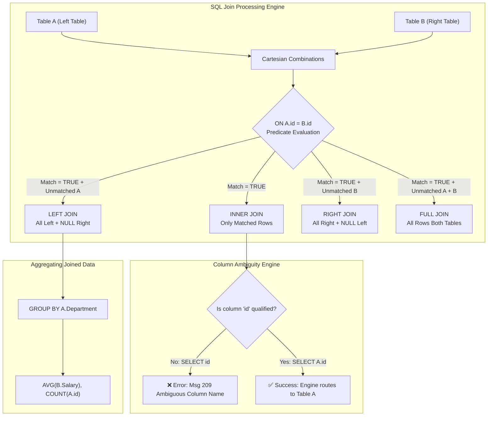

# 📘 DAY 16: ANSI SQL RELATIONAL JOINS SYNTAX, COLUMN AMBIGUITY & AGGREGATIONS

**Course:** Data Engineering Master Course  
**Batch:** Online Batch 15 | **Date:** 19 August 2026 (Wednesday)  
**Module 1:** Enterprise SQL Architecture & Query Engine  
**Companion Files:** [2026-08-19.sql](../01_CLASS_NOTES/2026-08-19.sql) | [2026-08-19_CLASS_TASK.SQL](../04_CLASS_TASKS/2026-08-19_CLASS_TASK.SQL)

---

## 🗺️ STEP 1: MIND MAP & EXECUTION WORKFLOW



---

## 📖 STEP 2: PLAIN-ENGLISH GLOSSARY & REAL-LIFE ANALOGIES

| Technical Term | Simple Plain-English Meaning | Real-Life Analogy |
| :--- | :--- | :--- |
| **ANSI SQL-92 Join** | The industry standard syntax for combining tables using explicit `JOIN ... ON` keywords. | A universal electrical plug that works cleanly and safely in every modern socket. |
| **Ambiguous Column** | A column name that exists in both tables, confusing the database engine. | Calling out "Hey Rahul!" in a classroom where two students share that exact name. |
| **Table Prefixing** | Writing the table name before the column (e.g. `A.id`) to remove any confusion. | Using a student's full name ("Rahul Sharma" vs "Rahul Verma") to specify who you mean. |
| **Table Alias** | Giving a short nickname to a table in the query (e.g. `FROM Employees AS E`). | Giving a friend a short nickname like "Cap" instead of their full legal name. |
| **Anti-Join Pattern** | Using an outer join plus `WHERE <key> IS NULL` to find rows with zero matches. | Checking an event guest list to find people who RSVP'd but never showed up. |
| **Data Type Coercion** | SQL Server automatically converting compatible types on `ON` conditions so values can match. | Exchanging a 100-rupee note for two 50-rupee notes; different formats, same value. |
| **`sp_rename`** | A built-in SQL Server procedure used to rename tables, columns, or indexes safely. | Submitting an official form to change a name on an existing identity card. |

---

## 🧠 STEP 3: CORE JOIN MECHANICS & ANSI SYNTAX

### 1. The Standard ANSI Join Blueprint

```sql
SELECT 
    t1.column1,
    t1.column2,
    t2.column3
FROM Table1 AS t1
[INNER | LEFT | RIGHT | FULL] JOIN Table2 AS t2
    ON t1.join_key = t2.join_key;
```

### 2. Deep Comparison: The 4 Primary Joins on Real Data

Consider two live tables:
- **`set1` (Employees):** Contains IDs `1, 2, 3, 4, 5, 6, 7, 8` (8 employees across IT, HR, Finance, Marketing, Sales).
- **`set2` (Salaries):** Contains IDs `1, 2, 3, 4, 5, 6, 9, 10` (8 salary records).

```
Matching Key Set: {1, 2, 3, 4, 5, 6} (6 matches)
Left-Only Key Set: {7, 8} (2 unmatched employees)
Right-Only Key Set: {9, 10} (2 unmatched salary records)
```

```
========================================================================================
1. INNER JOIN (Intersection Only)
========================================================================================
Query:
SELECT s1.id AS emp_id, s1.name, s1.dept, s2.salary, s2.age
FROM set1 AS s1
JOIN set2 AS s2 ON s1.id = s2.id;

Result (6 Rows):
+--------+--------+-----------+----------+-----+
| emp_id | name   | dept      | salary   | age |
+--------+--------+-----------+----------+-----+
| 1      | Arjun  | IT        | 45000.00 | 24  |
| 2      | Priya  | HR        | 52000.00 | 27  |
| 3      | Rahul  | Finance   | 60000.00 | 29  |
| 4      | Sneha  | Marketing | 48000.00 | 25  |
| 5      | Vikas  | IT        | 55000.00 | 28  |
| 6      | Neha   | Sales     | 42000.00 | 23  |
+--------+--------+-----------+----------+-----+

========================================================================================
2. LEFT OUTER JOIN (All Left Records + Matching Right Records)
========================================================================================
Query:
SELECT s1.id AS emp_id, s1.name, s1.dept, s2.salary, s2.age
FROM set1 AS s1
LEFT JOIN set2 AS s2 ON s1.id = s2.id;

Result (8 Rows - IDs 7 & 8 padded with NULL):
+--------+--------+-----------+----------+------+
| emp_id | name   | dept      | salary   | age  |
+--------+--------+-----------+----------+------+
| 1      | Arjun  | IT        | 45000.00 | 24   |
| 2      | Priya  | HR        | 52000.00 | 27   |
| 3      | Rahul  | Finance   | 60000.00 | 29   |
| 4      | Sneha  | Marketing | 48000.00 | 25   |
| 5      | Vikas  | IT        | 55000.00 | 28   |
| 6      | Neha   | Sales     | 42000.00 | 23   |
| 7      | Amit   | Finance   | NULL     | NULL |
| 8      | Pooja  | HR        | NULL     | NULL |
+--------+--------+-----------+----------+------+

========================================================================================
3. RIGHT OUTER JOIN (All Right Records + Matching Left Records)
========================================================================================
Query:
SELECT s2.id AS salary_id, s1.name, s1.dept, s2.salary, s2.age
FROM set1 AS s1
RIGHT JOIN set2 AS s2 ON s1.id = s2.id;

Result (8 Rows - IDs 9 & 10 padded with NULL for set1 columns):
+-----------+--------+-----------+----------+-----+
| salary_id | name   | dept      | salary   | age |
+-----------+--------+-----------+----------+-----+
| 1         | Arjun  | IT        | 45000.00 | 24  |
| 2         | Priya  | HR        | 52000.00 | 27  |
| 3         | Rahul  | Finance   | 60000.00 | 29  |
| 4         | Sneha  | Marketing | 48000.00 | 25  |
| 5         | Vikas  | IT        | 55000.00 | 28  |
| 6         | Neha   | Sales     | 42000.00 | 23  |
| 9         | NULL   | NULL      | 70000.00 | 31  |
| 10        | NULL   | NULL      | 65000.00 | 30  |
+-----------+--------+-----------+----------+-----+

========================================================================================
4. FULL OUTER JOIN (Complete Set Integration)
========================================================================================
Query:
SELECT 
    COALESCE(s1.id, s2.id) AS unified_id,
    s1.name, 
    s1.dept, 
    s2.salary, 
    s2.age
FROM set1 AS s1
FULL JOIN set2 AS s2 ON s1.id = s2.id;

Result (10 Rows: 6 Matched + 2 Left Unmatched + 2 Right Unmatched):
Total Output Count = 6 + 2 + 2 = 10 Rows.
```

---

## ⚠️ STEP 4: THE COLUMN AMBIGUITY TRAP & `sp_rename`

### 1. What Causes Error Msg 209?
When you join Table `A` (columns: `id`, `name`) and Table `B` (columns: `id`, `dept`):

```sql
-- ❌ CAUSES ERROR:
SELECT id, name, dept
FROM A JOIN B ON A.id = B.id;
```

**Database Engine Response:**
`Msg 209, Level 16, State 1, Line 1: Ambiguous column name 'id'.`

### 2. How to Permanently Fix It:
1. **Explicit Table Qualification:** `SELECT A.id, A.name, B.dept ...`
2. **Table Aliases (Industry Standard):**
   ```sql
   SELECT 
       e.id AS employee_id,
       e.name AS employee_name,
       d.dept AS department_name
   FROM A AS e
   JOIN B AS d
       ON e.id = d.id;
   ```

### 3. Renaming Column Metadata with `sp_rename`
If a legacy table has poorly named columns (e.g. `B.custid`), rename it directly via system stored procedure:
```sql
EXEC sp_rename 'B.custid', 'id', 'COLUMN';
```

---

## 🎯 STEP 5: THE ANTI-JOIN PATTERN & AGGREGATIONS

### 1. The Anti-Join Pattern (Finding Missing Records)
In real-world Data Engineering pipelines, anti-joins are used daily to find missing relationships (e.g. users who never completed onboarding, abandoned carts, doctors with zero assigned patients).

```sql
-- Pattern: LEFT JOIN + WHERE right_table_key IS NULL
SELECT 
    p.p_id,
    p.pname AS unassigned_patient
FROM p_info AS p
LEFT JOIN D_info AS d
    ON p.p_id = d.p_id
WHERE d.p_id IS NULL;
```

### 2. Combining Joins with `GROUP BY` Aggregations
When calculating group metrics (such as department-wise salary averages):
- **Why `INNER JOIN` can create Silent Data Loss:** If a newly created department has no employees with salary records, `INNER JOIN` will completely drop the department from the report!
- **Why `LEFT JOIN` is Enterprise Standard:** `LEFT JOIN` preserves all departments, outputting `NULL` or `0` for departments without payroll data.

```sql
SELECT 
    s1.dept AS department_name,
    AVG(s2.salary) AS average_salary,
    COUNT(s1.id) AS total_headcount,
    COUNT(s2.salary) AS salaried_headcount
FROM set1 AS s1
LEFT JOIN set2 AS s2
    ON s1.id = s2.id
GROUP BY s1.dept
ORDER BY average_salary DESC;
```

---

## 💼 STEP 6: TIER-1 INTERVIEW TRAPS & SCENARIOS

### Trap 1: "Do data types in the ON clause have to be 100% identical?"
- **Answer:** No! SQL Server performs implicit type conversion (coercion) if the types are compatible (e.g. `INT` vs `BIGINT`, or `VARCHAR` holding digits `'101'` vs `INT 101`).
- **Interview Caution:** While SQL allows it, implicit conversion in the ON clause disables index seeks and forces full table scans (index scan). In production Data Engineering, keys should always share identical data types.

### Trap 2: "What is the difference between filtering in the ON clause vs the WHERE clause in a LEFT JOIN?"
- **In ON clause (`LEFT JOIN B ON A.id = B.id AND B.status = 'ACTIVE'`):** The condition filters Table B *before* the outer join. If a row in Table A has no active Table B row, Table A is still returned with NULLs.
- **In WHERE clause (`LEFT JOIN B ON A.id = B.id WHERE B.status = 'ACTIVE'`):** The WHERE clause executes *after* the join. It discards rows where `B.status` is NULL, effectively converting your `LEFT JOIN` into an `INNER JOIN`!

---

## 📋 STEP 7: SELF-CHECK MASTERY CHECKLIST

- [x] Can write ANSI-92 `INNER`, `LEFT`, `RIGHT`, and `FULL OUTER` join queries from scratch.
- [x] Know how to explain and resolve the `Msg 209: Ambiguous column name` error.
- [x] Can use `sp_rename` to safely update database object metadata.
- [x] Mastered the Anti-Join query technique (`LEFT JOIN ... WHERE key IS NULL`).
- [x] Understand why `LEFT JOIN` is preferred over `INNER JOIN` when performing group aggregations across master entities.
- [x] Solved all 3 faculty homework tasks in [2026-08-19_CLASS_TASK.SQL](../04_CLASS_TASKS/2026-08-19_CLASS_TASK.SQL).
