# 📘 DAY 17: MULTI-TABLE RELATIONAL JOINS, CROSS JOIN CARTESIAN MATRICES & EQUI JOINS

**Course:** Data Engineering Master Course  
**Batch:** Online Batch 15 | **Date:** 20 August 2026 (Thursday)  
**Module 1:** Enterprise SQL Architecture & Query Engine  
**Companion Files:** [2026-08-20.sql](../01_CLASS_NOTES/2026-08-20.sql) | [2026-08-20_CLASS_TASK.SQL](../04_CLASS_TASKS/2026-08-20_CLASS_TASK.SQL)

---

## 🗺️ STEP 1: MIND MAP & MULTI-TABLE EXECUTION FLOW

```mermaid
flowchart TD
    subgraph MULTI_TABLE_PIPELINE["3-Way Enterprise Relational Pipeline"]
        C["Customer Master (c)\n[custid, Custname, city]"] --> J1{"JOIN Orders (o)\nON c.custid = o.custid"}
        O["Orders Transactions (o)\n[custid, pid, oid, quantity, T_date]"] --> J1
        J1 --> I1["Intermediate Dataset 1\nCustomer + Orders matched rows"]
        I1 --> J2{"JOIN Product (p)\nON o.pid = p.pid"}
        P["Product Catalog (p)\n[Pid, Pname, price, category]"] --> J2
        J2 --> RESULT["Final Joined Output\n[Custname, Pname, category, (quantity * price)]"]
    end

    subgraph CROSS_JOIN_ENGINE["Cartesian Cross Product Engine"]
        T1["Table A (N rows)"] --> X["CROSS JOIN (No ON clause)"]
        T2["Table B (M rows)"] --> X
        T3["Table C (P rows)"] --> X
        X --> COMBO["Total Rows = N x M x P Combinations\ne.g. IPL Match Pairings / Matrix Grids"]
    end

    subgraph LEGACY_VS_ANSI["Join Standards Comparison"]
        LEGACY["Legacy Comma Equi-Join\nFROM TableA, TableB\nWHERE A.id = B.id"]
        ANSI["ANSI SQL-92 Standard Join\nFROM TableA\nINNER JOIN TableB ON A.id = B.id"]
        LEGACY -.->|"Same Logical Result"| ANSI
        ANSI -->|"Separates Relational Link from Filter"| PROD["Industry Standard Best Practice"]
    end
```



---

## 📖 STEP 2: PLAIN-ENGLISH GLOSSARY & REAL-LIFE ANALOGIES

| Technical Term | Simple Plain-English Meaning | Real-Life Analogy |
| :--- | :--- | :--- |
| **Multi-Table Join** | Connecting three or more tables in a single SQL query by chaining `JOIN ... ON` links step-by-step. | A train where Engine connects to Coach A, Coach A connects to Coach B, and Coach B connects to Coach C. |
| **Intermediate Result Set** | The temporary virtual dataset created by the SQL engine after joining the first two tables before the third is joined. | Assembling burger patty and buns first before adding lettuce and sauce. |
| **Table Aliasing** | Assigning short 1-letter or 2-letter labels (e.g. `c`, `o`, `p`) to simplify long table names. | Calling your teammate "Cap" rather than their full formal legal name every single time. |
| **CROSS JOIN** | An unconditional join that multiplies every single row of Table 1 with every single row of Table 2 (`N x M`). | A round-robin sports tournament where every team plays against every other team. |
| **Equi Join** | A join condition that strictly matches rows based on equality (`=`) between related primary/foreign keys. | Matching keys to their exact keyholes; only identical matching teeth allow entry. |
| **Non-ANSI Comma Join** | An older SQL syntax that lists tables separated by commas in the `FROM` clause and filters keys in `WHERE`. | Mixing clean laundry and dirty laundry in one basket, then trying to sort it out afterwards. |
| **Quarter Filtering** | Using `DATEPART(qq, date)` to group or filter dates into 3-month business quarters (Q1, Q2, Q3, Q4). | Dividing a financial year into 4 business report cards to track corporate performance. |

---

## 🧠 STEP 3: CORE ARCHITECTURAL CONCEPTS & PATTERNS

### 1. The Anatomy of Chained Multi-Table Joins

In production enterprise databases, business data is normalized across multiple entity tables:
- **`Customer`**: Who bought it? (`custid`, `Custname`, `city`)
- **`Orders`**: When and how much was bought? (`custid`, `pid`, `oid`, `quantity`, `T_date`)
- **`Product`**: What item was bought and what is the unit price? (`Pid`, `Pname`, `price`, `category`)

#### Abstract 4-Table Chain Rule:
```sql
SELECT 
    A.column_a,
    B.column_b,
    C.column_c,
    D.column_d
FROM Table_A AS A
INNER JOIN Table_B AS B ON A.id = B.a_id
INNER JOIN Table_C AS C ON B.id = C.b_id
INNER JOIN Table_D AS D ON C.id = D.c_id;
```

---

### 2. Multi-Table Aggregations: LEFT JOIN vs INNER JOIN

When calculating total spend across customers:
- **`INNER JOIN`**: Returns **only** customers who have placed orders with valid product IDs. Customers with zero orders are completely eliminated.
- **`LEFT JOIN`**: Retains **all** customers. If a customer has never ordered anything, their `TotalSpent` returns `NULL` (or `0` when wrapped in `COALESCE/ISNULL`).

```sql
-- LEFT JOIN: Preserves all customers even if they have 0 purchases
SELECT 
    c.Custname,
    ISNULL(SUM(o.quantity * p.price), 0) AS TotalSpent
FROM Customer AS c
LEFT JOIN Orders AS o ON c.custid = o.custid
LEFT JOIN Product AS p ON o.pid = p.pid
GROUP BY c.Custname;
```

---

### 3. ANSI CROSS JOIN Mechanics & Cartesian Mathematics

A `CROSS JOIN` produces the Cartesian product of all participating tables.
No `ON` clause is required because every row from the left table is combined with every row from the right table.

**Cartesian Math Formula:**
- If Table 1 has `N` rows, Table 2 has `M` rows, and Table 3 has `P` rows:
- `Total Output Rows = N x M x P`

#### Real-World Practical Example: Sports Match Pairings
If you have a table of 4 IPL teams, generating every possible pairing without self-matches:
```sql
SELECT 
    t1.TeamName AS HomeTeam,
    t2.TeamName AS AwayTeam
FROM Teams AS t1
CROSS JOIN Teams AS t2
WHERE t1.TeamID <> t2.TeamID;
```

---

### 4. ANSI SQL-92 Standard vs Legacy Non-ANSI Equi Join

| Feature | ANSI SQL-92 Standard (`INNER JOIN ... ON`) | Legacy Non-ANSI (`FROM TableA, TableB WHERE ...`) |
| :--- | :--- | :--- |
| **Syntax** | `FROM A INNER JOIN B ON A.id = B.id` | `FROM A, B WHERE A.id = B.id` |
| **Clarity** | Relational link is clearly separated from business row filtering. | Relational join condition is mixed together with business filters in `WHERE`. |
| **Accidental Cartesian Trap** | Syntax error if `ON` clause is forgotten. | Produces huge dangerous Cartesian explosion if `WHERE` clause is forgotten. |
| **Outer Joins Support** | Clean `LEFT`, `RIGHT`, `FULL OUTER` syntax. | Non-standard proprietary syntax (e.g. `*=` or `=*`) deprecated in modern SQL. |

---

## 💻 STEP 4: PRACTICAL CODE LAB & SCENARIOS

### Scenario 1: Computing Line-Item Revenue across 3 Tables
```sql
SELECT 
    c.custid,
    c.Custname,
    c.city,
    p.Pname,
    p.category,
    o.quantity,
    p.price,
    (o.quantity * p.price) AS LineTotalRevenue
FROM Customer AS c
INNER JOIN Orders AS o ON c.custid = o.custid
INNER JOIN Product AS p ON o.pid = p.pid
ORDER BY LineTotalRevenue DESC;
```

### Scenario 2: Multi-Table Aggregation with Filter and Aggregate Condition
```sql
SELECT 
    c.Custname,
    c.city,
    COUNT(o.oid) AS TotalOrdersCount,
    SUM(o.quantity * p.price) AS TotalRevenue
FROM Customer AS c
INNER JOIN Orders AS o ON c.custid = o.custid
INNER JOIN Product AS p ON o.pid = p.pid
WHERE c.Custname LIKE '%a%'
GROUP BY c.Custname, c.city
HAVING SUM(o.quantity * p.price) > 250000
ORDER BY TotalRevenue ASC;
```

### Scenario 3: Temporal Slicing on Multi-Table Joins (Q1 & Q3 Orders)
```sql
SELECT 
    c.Custname,
    p.Pname,
    o.T_date,
    DATEPART(qq, o.T_date) AS OrderQuarter,
    DATENAME(mm, o.T_date) AS OrderMonthName
FROM Customer AS c
INNER JOIN Orders AS o ON c.custid = o.custid
INNER JOIN Product AS p ON o.pid = p.pid
WHERE DATEPART(qq, o.T_date) IN (1, 3);
```

---

## ⚠️ STEP 5: INTERVIEW TRAPS & COMMON BUGS

> [!WARNING]
> **Trap 1: The Broken Chained Join Key**
> When joining `Table_A` -> `Table_B` -> `Table_C`, attempting to join `Table_C` on `Table_A.id = Table_C.id` when no direct relationship exists will either fail or return distorted data. Always follow the foreign key path (`A -> B -> C`).

> [!WARNING]
> **Trap 2: The Comma Join Forgotten WHERE Clause Explosion**
> Writing `SELECT * FROM Customer, Product, Orders;` without a `WHERE` clause generates a full Cartesian product (`6 x 3 x 4 = 72` rows). On enterprise tables with millions of rows, this can crash the database server. Always use explicit ANSI `INNER JOIN ... ON`.

> [!WARNING]
> **Trap 3: Aggregating on LEFT JOIN without Handling NULLs**
> When performing `SUM(quantity * price)` on a `LEFT JOIN`, if a customer has 0 orders, `quantity` is `NULL` and `price` is `NULL`. `NULL * NULL` evaluates to `NULL`. In production reports, wrap in `ISNULL(SUM(...), 0)` to display `0.00` instead of blank/NULL.

---

## 🎯 STEP 6: SPARK & ENTERPRISE DATA ENGINEERING CONNECTION

In distributed Big Data engines (PySpark, Snowflake, Databricks Delta Lake):
1. **Multi-Way Broadcast Joins:** If `Product` is a small dimension table (e.g. 100 products) and `Orders` is a massive trillion-row fact table, the Spark optimizer automatically performs a **Broadcast Hash Join** on `Product` to eliminate heavy distributed data shuffling across cluster nodes.
2. **CROSS JOIN in Spark (`crossJoin`):** In PySpark, Cartesian products are strictly forbidden by default unless explicitly written as `df1.crossJoin(df2)` or `spark.sql.crossJoin.enabled = true` because an unmonitored cross join on distributed nodes causes Out-Of-Memory (OOM) cluster crashes.

---

## 🏁 STEP 7: SELF-EVALUATION QUIZ & SOLUTION KEYS

### 1. Quick Self-Test Questions
1. In a 3-table join (`A JOIN B JOIN C`), how many `ON` clauses are required?
2. If Table A has 10 rows, Table B has 5 rows, and Table C has 4 rows, how many rows are returned by `SELECT * FROM A CROSS JOIN B CROSS JOIN C`?
3. What is the key architectural difference between ANSI `INNER JOIN` and Non-ANSI Equi Join?
4. How do you extract the fiscal quarter from a date column in SQL Server?

### 2. Solution Keys
1. **Exactly 2 `ON` clauses** (One for `A JOIN B ON ...`, and one for `JOIN C ON ...`).
2. **200 rows** (`10 x 5 x 4 = 200`).
3. ANSI `INNER JOIN ... ON` cleanly isolates join relationships from row filtering conditions, whereas legacy comma equi-joins mix table joins and row filters together inside the `WHERE` clause.
4. Using the `DATEPART(qq, date_column)` function, which returns `1`, `2`, `3`, or `4`.
