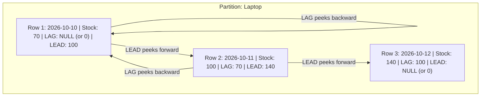

# 🚀 7-STEP REVISION BLUEPRINT — 2026-08-25 (DAY 21)
## Topic: Value Window Functions (LEAD & LAG), Running Aggregate Windows & Period-over-Period Delta Pipelines
**Module:** `01_SQL` (Relational Architecture & Analytical Engine)  
**Target Mastery:** SDE-2 / Senior Data Engineer Level (Tier-1 Enterprise Standards)

---

## 📌 STEP 1: EXECUTIVE SUMMARY & CORE MENTAL MODEL

In classical SQL, comparing a value in the current row with a value from an earlier or later row required expensive **Self-Joins** or complex correlated subqueries. For example, to calculate month-over-month revenue growth, you had to join a table against itself on `Date = PreviousDate`. This created $O(N^2)$ quadratic scanning overhead and massive memory bottlenecks.

**Value Window Functions** (`LEAD` and `LAG`) eliminate self-joins entirely. They introduce an in-memory sliding cursor that allows the query engine to peek forwards (`LEAD`) or backwards (`LAG`) across row partitions in a **single table scan** with $O(N)$ linear complexity.

### 💡 The Real-World Analogy (The Train Passenger & Mirror Lookahead)
- Imagine standing on a single-file train queue:
  - **`LAG()`** is like asking the person standing **behind you in line**: *"What ticket number do you have?"*
  - **`LEAD()`** is like looking over the shoulder of the person standing **in front of you**: *"What ticket number are you holding?"*
  - **`PARTITION BY`** is like dividing the queue into separate coaches (e.g. AC Coach vs Sleeper Coach)—you only ask people within your own coach!

---

## 📖 STEP 2: VOCABULARY & DEFINITIONS

| Term | Simple Definition | Practical Context |
| :--- | :--- | :--- |
| **Inter-Row Navigation** | Moving between adjacent rows without changing row structure. | Peeking at yesterday's stock while standing on today's row. |
| **Offset** | The step distance (number of rows) to look ahead or behind. | `LEAD(Sales, 2)` means look 2 rows ahead. Default is 1. |
| **Default Fallback** | The value returned when the offset reaches past the partition boundary. | `LAG(Sales, 1, 0)` returns `0` instead of `NULL` for row 1. |
| **Running Total (Cumulative)** | A running sum that accumulates row by row in sequence. | Calculating bank account balance after every transaction. |
| **Period-over-Period (PoP)** | Comparing current cycle metric with prior cycle (MoM, YoY). | Measuring revenue growth between 2025 and 2026. |

---

## 🏗️ STEP 3: VISUAL ARCHITECTURE & DATA FLOW



---

## 💻 STEP 4: CORE CONCEPTS & PRACTICAL SQL CODE LABS

### 🔬 Concept 1: `LEAD()` & `LAG()` Syntax and Defaults
Syntax:
```sql
LEAD(expression, [offset], [default_value]) OVER (
    [PARTITION BY partition_column]
    ORDER BY sort_column [ASC|DESC]
)
```

#### Lab 1: Basic Lookahead and Lookback
```sql
SELECT 
    StudentID,
    StudentName,
    Marks,
    LAG(Marks, 1, 0) OVER (ORDER BY StudentID) AS PrevStudentMarks,
    LEAD(Marks, 1, 0) OVER (ORDER BY StudentID) AS NextStudentMarks
FROM StudentInfo;
```

#### Lab 2: Partition-Scoped Lookback with Subject Boundaries
```sql
SELECT 
    Subject,
    StudentID,
    StudentName,
    Marks,
    LAG(Marks, 1, 0) OVER (
        PARTITION BY Subject 
        ORDER BY StudentID
    ) AS PrevSubjectMarks
FROM StudentInfo;
```

---

### 🔬 Concept 2: Inventory Restock & Consumption Delta Pipeline
Calculating the daily change in stock inventory.

```sql
WITH StockDeltaCTE AS
(
    SELECT 
        PName,
        DateT,
        Stock,
        LEAD(Stock, 1, Stock) OVER (
            PARTITION BY PName 
            ORDER BY DateT
        ) AS NextDayStock
    FROM Stock
)
SELECT 
    PName,
    DateT,
    Stock AS CurrentStock,
    NextDayStock,
    (NextDayStock - Stock) AS InventoryVariance
FROM StockDeltaCTE;
```

---

### 🔬 Concept 3: Running Cumulative Aggregates
When `ORDER BY` is added to an aggregate function within `OVER()`, it transforms from a static group aggregate to a **running cumulative window**.

```sql
SELECT 
    StudentID,
    StudentName,
    Subject,
    Marks,
    -- Running Minimum
    MIN(Marks) OVER (
        PARTITION BY Subject 
        ORDER BY Marks
    ) AS RunningSubjectMin,
    -- Cumulative Sum
    SUM(Marks) OVER (
        PARTITION BY Subject 
        ORDER BY Marks
    ) AS CumulativeSubjectMarks
FROM StudentInfo;
```

---

## ⚠️ STEP 5: EDGE CASES, BUG TRAPS & EXECUTION ORDER

### 🪤 Trap 1: The NULL Offset Trap
- **Issue:** By default, if `LAG()` or `LEAD()` scans outside the partition boundary, it returns `NULL`.
- **Bug:** Arithmetic operations like `Stock - LEAD(Stock)` result in `NULL` if default is not provided!
- **Fix:** Always provide a 3rd parameter: `LEAD(Stock, 1, 0)` or `LEAD(Stock, 1, Stock)`.

### 🪤 Trap 2: Logical Execution Order (Msg 4108)
- Window functions evaluate during the **SELECT** phase (Step 6 of SQL execution):
  `FROM -> WHERE -> GROUP BY -> HAVING -> WINDOW FUNCTIONS -> SELECT -> ORDER BY`
- **Result:** You cannot filter directly by window calculations in the `WHERE` clause.
- **Fix:** Wrap the window calculation inside a **CTE** or derived table.

---

## 🏢 STEP 6: REAL-WORLD ENTERPRISE PRODUCTION SCENARIOS

### 🏭 Scenario: Customer Order Churn & Gap Detection
Identify customers who have an inactivity gap of greater than or equal to 30 days between consecutive orders.

```sql
WITH OrderGapCTE AS
(
    SELECT 
        CustomerID,
        OrderID,
        OrderDate,
        LAG(OrderDate) OVER (
            PARTITION BY CustomerID 
            ORDER BY OrderDate
        ) AS PrevOrderDate
    FROM Orders
)
SELECT 
    CustomerID,
    OrderID,
    PrevOrderDate,
    OrderDate AS LatestOrderDate,
    DATEDIFF(day, PrevOrderDate, OrderDate) AS DaysGap
FROM OrderGapCTE
WHERE PrevOrderDate IS NOT NULL 
  AND DATEDIFF(day, PrevOrderDate, OrderDate) >= 30;
```

---

## 🎯 STEP 7: HIGH-YIELD INTERVIEW QUESTIONS & KEYS

### Q1: What is the computational difference between calculating YoY growth via self-join vs LAG()?
> **Answer:** A self-join performs a Cartesian match on dates ($O(N^2)$ worst case or $O(N \log N)$ with indexes), requiring two table scans and hash/merge join buffers. `LAG()` executes in a single linear table scan ($O(N)$) using an in-memory window frame buffer.

### Q2: What happens if offset is omitted in `LEAD(col)`?
> **Answer:** Offset defaults to 1. If the default fallback parameter is also omitted, it returns `NULL` when going past boundary rows.

### Q3: How do you calculate running sum vs total sum using window functions?
> **Answer:** 
> - Total partition sum: `SUM(Amount) OVER (PARTITION BY Dept)` (No ORDER BY).
> - Running cumulative sum: `SUM(Amount) OVER (PARTITION BY Dept ORDER BY OrderDate)` (With ORDER BY).
