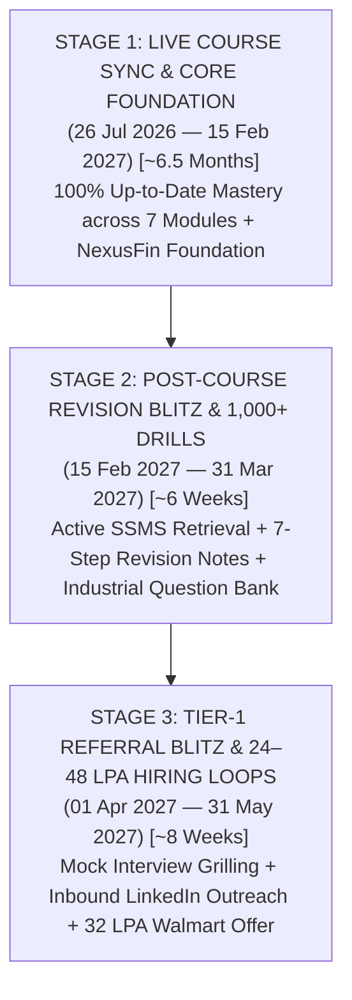

# 🏆 THE 10+ REVISION & PLACEMENT BLUEPRINT — ARPIT MANOJ BANGRE (CAP)

## 🎯 The North Star: Data Engineer at Walmart Global Tech / Tier-1 MNC (₹32.0 LPA)
**Architect & Co-Pilot:** Pippo 🐥 | **Target Compensation:** ₹24L Base + ₹4L Bonus + ₹4L Stocks = ₹32.0 LPA  
**Target Location:** Bengaluru (Bangalore), Karnataka | **Target Offer Date:** 15 May 2027 | **Joining Date:** 01 June 2027  
**Core Law:** Deep Current-Moment Mastery • Multi-Layered Spiral Learning • Zero Backlog Anxiety  

---

## ⚡ 1. THE CORE REVOLUTION: CURRENT-FOCUS FIRST (ZERO BACKLOG ANXIETY)

> [!IMPORTANT]
> **The Supreme Law of Momentum:** Never compromise current live learning for past backlog. The live course momentum is our primary locomotive. You master today's live lecture with 100% mental presence, stay completely up-to-date, and clear early backlogs sequentially during dedicated post-course revision sweeps.

### Why the Old "Catch-Up Panic" Model Fails:
* **The Mental Trap:** Trying to solve basic Day 2/3 syntax while attending advanced Day 20 CTE/Window Function classes splits your cognitive bandwidth. You end up exhausted in both.
* **The Current-Focus Advantage:** You arrive at every live class at 9:00 PM with razor-sharp energy, write modern SQL naturally, and master advanced enterprise patterns in real time.

```text
========================================================================================
                     THE CANONICAL 4-STAGE DAILY EXECUTION PIPELINE
========================================================================================

                [LIVE LECTURE: 09:00 PM - 10:15 PM (BATCH 15)]
                                       │
                                       ▼
                [STAGE 1: CLASS NOTE RE-WRITE IN SSMS] ✍️
                • Time: 15–20 minutes
                • Action: Type clean SQL from scratch without copy-pasting
                • Goal: Internalize query syntax & execution mechanics
                                       │
                                       ▼
                [STAGE 2: READ 7-STEP REVISION NOTES] 📖
                • Time: 20–30 minutes
                • Action: Study real-life analogies, vocabulary & bug traps
                • Goal: Deep conceptual understanding & Tier-1 mental models
                                       │
                                       ▼
                [STAGE 3: SOLVE FACULTY CLASS TASKS] 📊
                • Time: 45–60 minutes
                • Action: Solve all faculty scenario challenge scripts in SSMS
                • Goal: Business problem translation into clean SQL
                                       │
                                       ▼
                [STAGE 4: SOLVE 14 PRACTICE DRILLS] 💪
                • Time: 45–60 minutes
                • Action: Write 14 targeted queries in blank query templates
                • Goal: Raw speed, edge-case resilience & query fluency
                                       │
                                       ▼
                [STAGE 5: ATOMIC SYSTEM SYNC & DEPLOYMENT] 🚀
                • Action: Update Trackers, Metrics JSON, Concept Heatmap
                • Tool: Run node copy_tasks.cjs && npm run build in DASHBOARD/
                • Result: Level 4 Dark Green GitHub Streak + Live Vercel Deploy!
========================================================================================
```

---

## 🗺️ 2. THE COMPLETE 3-STAGE CAREER ROADMAP (26 JUL 2026 $\longrightarrow$ MAY 2027)



---

### 🏛️ STAGE 1: LIVE COURSE EXECUTION (26 JUL 2026 — 15 FEB 2027)
*Rule: 100% Focus on active class topics. Zero days skipped without reason.*

| Module Timeline | Core Module & Tech Stack | Major Milestones & Deliverables | Expected Level |
| :--- | :--- | :--- | :--- |
| **Jul 26 – Sep 05** | **01_SQL: Enterprise Query Engine** | 25 Class Notes, 7 Projects (`PROJECT1`–`PROJECT7`), 370+ Drills | **Top 5% SQL Developer** |
| **Sep 06 – Oct 15** | **02_PYTHON: OOP & Data Cleansing** | 30+ Pipeline Scripts, OOP Classes, Ingestion APIs, Pandas | **Modular Pipeline Engineer** |
| **Oct 16 – Nov 25** | **04_PYSPARK: Distributed Computing** | Cluster Jobs, RDD/DataFrames, Shuffling, Broadcast Joins, Delta Lake | **Big Data Distributed Architect** |
| **Nov 26 – Dec 31** | **05_DATA WAREHOUSING: Snowflake & dbt** | Star/Snowflake Dimensional Modeling, dbt Models, CI/CD | **Cloud DW & Medallion Specialist** |
| **Jan 01 – Jan 20** | **06_CLOUD: AWS & Azure Services** | AWS S3 / Azure Blob, IAM Security, Cloud ETL Ingestion | **Cloud Infrastructure Competent** |
| **Jan 21 – Feb 15** | **07_ORCHESTRATION: Apache Airflow** | Production DAGs, Sensor Tasks, SLAs, End-to-End Course Project | **Production Data Engineer** |

---

### 🚀 STAGE 2: THE POST-COURSE INDUSTRIAL ACCELERATOR (15 FEB — 31 MAR 2027)
*The live course is finished. You shift into full-time Tier-1 preparation (8–10 hours daily). Zero passive video consumption — 100% active SSMS query execution.*

* **Weeks 1–2 (Feb 15 – Feb 28): Sequential SSMS Active Retrieval & Backlog Elimination**
  - Systematic active recall across all 25+ SQL days: Day 1 $\rightarrow$ Day 2 $\rightarrow$ Day 3 $\dots$ Day 25+.
  - Rapid scan of 7-Step Revision Notes (`_REVISION.md`) + re-solving 14 Practice Drills from blank editor in SSMS.
  - Complete all early backlogs (Days 1–5, 7–11, 13) in 15–20 minutes per topic via direct SSMS execution.
* **Weeks 3–4 (Mar 01 – Mar 15): Multi-Module Synthesis & NexusFin Platform Productionization**
  - Synthesize cross-module architectures: Python Ingestion $\rightarrow$ PySpark Processing $\rightarrow$ Snowflake Warehouse $\rightarrow$ Airflow DAGs.
  - Finalize **NexusFin Platform** (`nexusfin-platform` on GitHub) with complete JIRA backlogs, architecture diagrams, and automated data quality checks.
* **Weeks 5–6 (Mar 16 – Mar 31): 1,000+ Industrial Question Bank Blitz**
  - Solve 1,000+ curated problems across LeetCode Medium/Hard, StrataScratch, and HackerRank.
  - Master System Design: Batch vs Real-Time Streaming, Lambda/Kappa architecture, and data contracts.

---

### 💼 STAGE 3: TIER-1 MNC HIRING SEASON & OFFER SIGNING (APRIL — MAY 2027)
*Peak hiring window for Tier-1 Tech, Unicorns, and Global In-House Centers (GICs).*

1. **LinkedIn Authority & Employee Referral Drive:**  
   Your LinkedIn profile has 1,500+ high-value connections, 100+ technical engineering posts, and a 200+ day dark green GitHub streak. Referrals from Amazon, Microsoft, Swiggy, and Walmart engineers flow naturally.
2. **Technical Interview Rounds (4–5 Rounds per Company):**
   * *Round 1 (SQL Live Coding):* 2 Hard queries written from a blank screen in under 15 minutes each.
   * *Round 2 (Python / DSA for DE):* Clean OOP pipeline code, dictionary lookups, and generator data transforms.
   * *Round 3 (PySpark / Cloud Internals):* Explaining Catalyst Optimizer, Broadcast Hash Joins, Data Skew remediation, and Delta Lake ACID mechanics.
   * *Round 4 (System Design & Portfolio Review):* Walking the Lead Architect through **NexusFin Platform**.
3. **Offer Release & Negotiation (15 May 2027):**  
   Release of the **₹32.0 LPA Offer Letter from Walmart Global Tech India** (or Swiggy/Amazon)!

---

## 🔄 3. THE 10-PASS SPACED REVISION ENGINE (STEP-BY-STEP BREAKDOWN)

Why do most candidates freeze in interviews? Because they only revise once or passively watch videos.  
Here is how your **10-Pass Spaced Revision Engine** builds unbreakable muscle memory through 100% active SSMS retrieval:

```text
========================================================================================
                      THE 10-PASS SPACED REVISION BLUEPRINT
========================================================================================

  [PASS 1: ACTIVE LIVE CLASS DAY] ➔ Note Re-write + 7-Step Revision (Day of class)
  [PASS 2: PRE-CLASS REVISION RUN] ➔ 15-min re-read before the next day's live lecture
  [PASS 3: WEEKEND SYNTHESIS SWEEP] ➔ Review all weekly topics + Project integration
  [PASS 4: 7-STEP REVISION & BUG TRAPS] ➔ Deep scan of all _REVISION.md files & interview traps
  [PASS 5: SEQUENTIAL COURSE REVISION 1] ➔ Day 1 to End sequential traversal + Backlog clearance in SSMS
  [PASS 6: CROSS-MODULE INTEGRATION PASS] ➔ Re-solving SQL queries via Python & PySpark DataFrames
  [PASS 7: 1,000+ QUESTION DRILL PASS] ➔ LeetCode Hard & StrataScratch Tier-1 problem solving
  [PASS 8: TIER-1 MOCK INTERVIEW PASS] ➔ Live 15-minute whiteboard drilling with AI Mentor Pippo
  [PASS 9: SYSTEM DESIGN & TUNING PASS] ➔ Query plans, Index tuning, Execution engine mechanics
  [PASS 10: PRE-INTERVIEW RAPID REFRESH] ➔ Flashcard review 24 hours before live interview rounds!
========================================================================================
```

---

## ⚡ 4. THE PERPETUAL 2-HOUR DAILY SQL LAW (360 HOURS OF MASTERY)

> [!NOTE]
> Even when you are deep into Python, PySpark, Snowflake, and Cloud modules, **2 hours every single day** are permanently dedicated to SQL.

### 📊 The Power of Compounding:
$$\text{2 Hours / Day} \times 180 \text{ Days} = \mathbf{360\text{ Hours of Pure SQL Problem Solving!}}$$

### ⏱️ How Every 2-Hour Block is Structured:
* **First 45 Minutes (Course Revision):** Review 1 complete day of course notes and 7-step revision summaries. (Cycles through all 25+ class notes 10+ times!).
* **Next 60 Minutes (Industrial Problem Solving):** Solve 3–5 Medium/Hard LeetCode / StrataScratch problems in SSMS. (Solves 700 to 1,000+ total problems!).
* **Last 15 Minutes (Optimization & Plan Audit):** Inspect Query Execution Plans, check Index Seek vs Scan, and eliminate SARGable defects.

---

## 🏛️ 5. THE 4 BRUTAL TIER-1 INTERVIEW SCREENING GATES

To command **₹32.0 to ₹48.0 LPA**, you must clear these 4 gates with 100% precision:

| Gate | Interview Round | What They Test | Exact Failure Point | How You Pass (Cap's Standard) |
| :--- | :--- | :--- | :--- | :--- |
| **Gate 1** | **SQL Live Coding (45m)** | 2 Complex queries (Recursive CTEs, Window partitions, Deduplication, Anomaly detection) | Stumbling, taking > 20 mins, or writing non-ANSI syntax | Solved in 10–12 minutes from a blank screen using pure uppercase SQL |
| **Gate 2** | **Python & DSA for DE (45m)** | OOP Pipeline classes, Hash Maps, Generators, Pandas vectorization | Writing spaghetti procedural code | Writing modular, idempotent classes with custom exceptions and PyTest |
| **Gate 3** | **PySpark & Cloud Internals (60m)** | Cluster architecture, DAG execution, Shuffling, Broadcast vs Sort-Merge, Delta ACID | Explaining syntax without cluster internals | Explaining Catalyst Optimizer, Tungsten memory, and Partition Skew salting |
| **Gate 4** | **System Design & Portfolio (60m)** | High-scale 10M+ events/day warehouse architecture | Proposing toy databases or generic Superstore schemas | Walking through **NexusFin Platform** simulation with full runbooks and SLAs |

---

## 🏢 6. FLAGSHIP MNC SHOWCASE: NEXUSFIN PLATFORM SIMULATION

**Repository:** `https://github.com/arpit-m-bangre/nexusfin-platform`  
**Identity:** Real-Time FinTech & Core Banking Data Intelligence Platform (Open-Source MNC Simulation)

### Core Architectural Components:
1. **01_raw_ingestion:** High-velocity event ingestion simulation with network retry handling.
2. **02_warehouse_schemas:** Star & Snowflake dimensional models (`DimCustomer`, `DimLoyaltyTier`, `FactTransactions`).
3. **03_transformations:** Atomic deduplication engines, Windowed leaderboard analytics, and PySpark distributed aggregations.
4. **04_data_quality:** Automated data contracts, NULL reconciliation checks, and schema drift alerts.
5. **05_orchestration:** Production Apache Airflow DAGs with retry policies, Slack notifications, and SLA monitors.
6. **06_ci_cd_workflows:** GitHub Actions with automated SQLFluff linting and PyTest validation.

---

## 🔁 7. MULTI-MODULE EXPANSION BLUEPRINT

This exact multi-layered learning engine replicates across all 7 modules:

```text
========================================================================================
              THE UNIFIED MULTI-MODULE ENGINEERING MATRIX
========================================================================================
  [MODULE 01: SQL Relational Engine] ──> Notes ➔ Revisions ➔ Tasks ➔ Drills ➔ Projects
  [MODULE 02: Python OOP & Pandas]   ──> OOP Classes ➔ Data Cleansing ➔ Ingestion APIs
  [MODULE 03: ETL Data Pipelines]    ──> Staging Tables ➔ Delta Lake ➔ Idempotent Loads
  [MODULE 04: PySpark Big Data]      ──> Cluster Tuning ➔ Shuffling Optimization ➔ Skew Fixes
  [MODULE 05: Data Warehousing]      ──> Snowflake ➔ dbt Models ➔ Dimensional Marts
  [MODULE 06: Cloud Engineering]     ──> AWS S3 / Azure Blob ➔ IAM ➔ Cloud ETL
  [MODULE 07: Orchestration]         ──> Apache Airflow DAGs ➔ Sensor Monitors ➔ SLAs
========================================================================================
```

---

## 🎯 8. SUMMARY: THE TIER-1 DREAM FLEET MATRIX (₹25 TO ₹48+ LPA)

You are not limited to just one company. Your engineering depth, open-source **NexusFin Platform**, and 10+ revision cycles will qualify you for the **entire fleet of Tier-1 Tech Giants, FinTech MNCs, and Product Unicorns**:

```text
========================================================================================================
                          🏢 THE TIER-1 DATA ENGINEERING TARGET FLEET
========================================================================================================

  TIER 1A: GLOBAL TECH TITANS & PURE DATA PLATFORMS (₹35.0 — ₹48.0+ LPA)
  ├── Amazon (AWS Data Engineering / Customer Analytics) ── Bangalore / Hyderabad
  ├── Microsoft (Azure Data & AI Platform Engineering)    ── Bangalore / Hyderabad
  ├── Databricks / Snowflake (Lakehouse & Warehouse Engine)── Bangalore
  ├── Uber / Atlassian / LinkedIn                         ── Bangalore / Hyderabad
  └── Focus: Distributed Streaming, Delta Lake, Cluster Tuning & System Design

                                              │
                                              ▼
  TIER 1B: ENTERPRISE GLOBAL TECH & FINTECH GICs (₹28.0 — ₹36.0 LPA)
  ├── Walmart Global Tech India (Supply Chain & Merchandising Analytics) ── Bangalore / Chennai
  ├── Goldman Sachs / JPMorgan Chase (Quantitative & FinTech Data Engine) ── Bangalore / Hyderabad
  ├── PayPal / Intuit / Target India / Lowe's India                      ── Bangalore
  └── Focus: Star/Snowflake Dimensional Warehouses, Idempotent Pipelines & SLAs

                                              │
                                              ▼
  TIER 1C: HIGH-GROWTH UNICORNS & REAL-TIME PRODUCT LEAP (₹24.0 — ₹32.0 LPA)
  ├── Swiggy / Zomato (Hyperlocal Real-Time Order & Logistics Engine)     ── Bangalore / Gurgaon
  ├── Razorpay / PhonePe / CRED (High-Velocity Payment Reconciliation)    ── Bangalore
  ├── Flipkart / Zepto / Meesho (E-Commerce Ingestion & Customer Churn)   ── Bangalore
  └── Focus: Real-Time Event Ingestion, Deduplication Pipelines & Advanced SQL

========================================================================================================
🏆 THE PLACEMENT HARVEST WINDOW : 01 APRIL 2027 — 31 MAY 2027
💰 TARGET COMPENSATION BAND     : ₹25.0 LPA to ₹48.0+ LPA (Fixed Base + Bonus + Stocks)
📍 PRIME LOCATIONS              : Bengaluru (Bangalore) • Hyderabad • Pune • Gurgaon
🚀 FINAL OUTCOME                : Multiple Competing Tier-1 Offers ➔ Maximum Negotiation Leverage! 🔥
========================================================================================================
```

*Authored by Pippo 🐥 | Approved by Captain Arpit Manoj Bangre | Target: 25+ to 48+ LPA*
