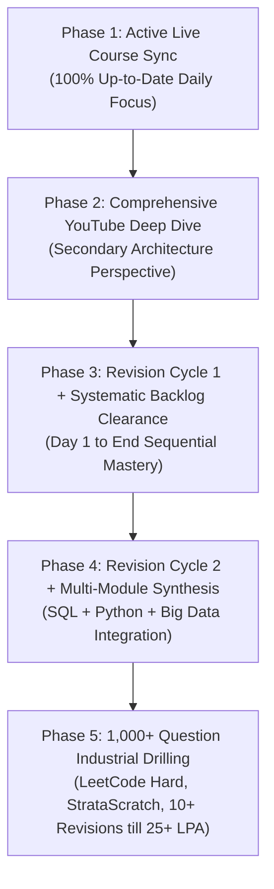

# 🏆 THE 10+ REVISION & PLACEMENT BLUEPRINT — ARPIT MANOJ BANGRE (CAP)

## 🎯 North Star Target: Tier-1 MNC Data Engineer (25+ to 60+ LPA Target)
**Strategist:** Pippo 🐥 | **Philosophy:** Deep Current-Moment Mastery • Structured Multi-Layered Revision • Zero Backlog Anxiety

---

## ⚡ 1. THE CORE STRATEGIC SHIFT (CURRENT-FOCUS FIRST)

> [!IMPORTANT]
> **The Golden Rule:** Never compromise current live learning for past backlog. The live course momentum is our primary engine. We master the current topic in full depth, stay 100% up-to-date, and clear early backlogs systematically during dedicated post-course revision cycles.

```text
================================================================================
                     CURRENT DAILY EXECUTION FLOW
================================================================================
                    
   [LIVE LECTURE (9:00 PM - 10:15 PM)]
                   │
                   ▼
   [STEP 1: CLASS NOTE RE-WRITE IN SSMS] ✍️
   (Build muscle memory and syntax command)
                   │
                   ▼
   [STEP 2: READ 7-STEP REVISION NOTES] 📖
   (Master conceptual architecture, analogies & bug traps)
                   │
                   ▼
   [STEP 3: SOLVE FACULTY CLASS TASKS] 📊
   (Solve all in-class scenario homework scripts)
                   │
                   ▼
   [STEP 4: SOLVE 14 PRACTICE DRILLS] 💪
   (Targeted 14-question problem sets in SSMS)
                   │
                   ▼
   [STEP 5: ATOMIC SYSTEM SYNC & DEPLOY] 🚀
   (Trackers, Heatmap, Metrics, GitHub Streak & Vercel Deploy)
================================================================================
```

---

## 🗺️ 2. THE 5-PHASE 10+ REVISION ARCHITECTURE (TILL PLACEMENT)



---

### 📍 Phase 1: Live Course Execution (Active Now)
* **Goal:** Zero lag on daily live lectures.
* **Daily Standard:** Re-write Note $\rightarrow$ Read Revision $\rightarrow$ Solve Class Tasks $\rightarrow$ Solve Practice Drills.
* **Outcome:** Pristine daily conceptual clarity, Level 4 Dark Green GitHub graph, live Vercel portfolio.

### 📍 Phase 2: Supplementary YouTube Course Deep-Dive
* **Goal:** Strengthen foundational theory and edge cases from an alternative enterprise syllabus.
* **Execution:** High-speed video lectures, dedicated notes, and alternative scenario drilling.

### 📍 Phase 3: Revision Cycle 1 + Systematic Backlog Clearance
* **Goal:** Re-traverse the entire live course from Day 1 to End with complete mastery.
* **Backlog Strategy:** Early backlog topics (Days 1–5, Days 7–11, Day 13) are cleared sequentially and seamlessly without any pressure or rush during this dedicated revision block.

### 📍 Phase 4: Revision Cycle 2 (Live + YouTube Synthesis)
* **Goal:** Cross-pollinate insights from both live and YouTube curricula.
* **Execution:** Advanced query optimization, execution plan analysis, index tuning, and CTE/Window function combinations.

### 📍 Phase 5: 1,000+ Industrial Question Bank & Interview Grilling
* **Goal:** Absolute query mastery under pressure.
* **Execution:** 1,000+ curated SQL problems (LeetCode, HackerRank, StrataScratch, Tier-1 MNC interview questions).
* **Cadence:** Continuous 10+ spaced repetition revisions until multiple 25+ LPA offers are secured.

---

## 🔁 3. REPLICATION ACROSS ALL FUTURE MODULES

This exact multi-layered learning engine will replicate across every single upcoming module in the course:
1. **Module 01:** SQL Relational Architecture & Analytic Engines
2. **Module 02:** Python, OOP & High-Performance Data Cleansing (Pandas)
3. **Module 03:** ETL Ingestion, Delta Lake & Production Pipelines
4. **Module 04:** PySpark Distributed Big Data & Cluster Architecture
5. **Module 05:** Snowflake, dbt & Cloud Dimensional Modeling
6. **Module 06:** AWS / Azure Cloud Data Engineering Services
7. **Module 07:** Apache Airflow DAG Orchestration & Enterprise Productionization

---

## 🎯 4. IMMEDIATE TOMORROW ACTION PLAN (TUESDAY, 25 AUG 2026)

* **Mission Focus:** **Day 20 (2026-08-24: Common Table Expressions & Zero-Loss Deduplication)**
  1. Re-write [`01_SQL/01_CLASS_NOTES/2026-08-24.sql`](file:///d:/DE%20COURSE/01_SQL/01_CLASS_NOTES/2026-08-24.sql) in SSMS.
  2. Read [`01_SQL/03_REVISION_NOTES/2026-08-24_REVISION.md`](file:///d:/DE%20COURSE/01_SQL/03_REVISION_NOTES/2026-08-24_REVISION.md).
  3. Solve 8 Faculty Class Tasks in [`01_SQL/04_CLASS_TASKS/2026-08-24_CLASS_TASK.SQL`](file:///d:/DE%20COURSE/01_SQL/04_CLASS_TASKS/2026-08-24_CLASS_TASK.SQL).
  4. Solve 14 Targeted Practice Drills in [`01_SQL/05_INDEX_WISE_QUESTIONS/2026-08-24_QUESTIONS.SQL`](file:///d:/DE%20COURSE/01_SQL/05_INDEX_WISE_QUESTIONS/2026-08-24_QUESTIONS.SQL).
  5. Complete English Practice Book Task.
  6. Attend Live Data Engineering Class (Day 21) at 09:00 PM.

---

*Authored by Pippo 🐥 | Approved by Captain Arpit Manoj Bangre | Target: 25+ LPA*
