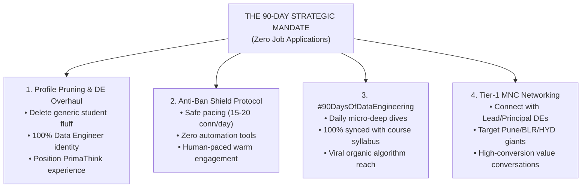
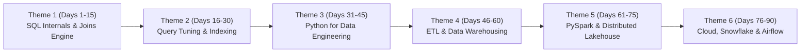

# 🚀 LINKEDIN DATA ENGINEER AUTHORITY & 90-DAY NETWORKING BLUEPRINT
## 🎯 TARGET: TIER-1 DATA ENGINEERING NETWORKING (NO JOB APPLICATIONS) | ZERO-BAN SAFETY PROTOCOL

**Candidate:** Arpit Manoj Bangre (Cap)  
**Current Network:** ~392 Connections | 399 Followers | Active LinkedIn Premium (90 Days Active Window)  
**Core Strategy:** **Zero Job Applications for 90 Days** — 100% Inbound Authority, High-Value MNC Networking & Daily Technical Series  
**Target Hubs:** Pune, Bengaluru, Hyderabad, Mumbai, Remote  
**Strategic Co-Pilot:** Pippo 🐥  

---

## 🗺️ STRATEGIC OBJECTIVES: THE 90-DAY GAMEPLAN



---

## 🛡️ CRITICAL: THE LINKEDIN ANTI-BAN & SAFETY SHIELD PROTOCOL

> [!CAUTION]
> **LinkedIn Algorithm Alert:** LinkedIn's anti-spam detection flags accounts that suddenly send 50+ requests in 10 minutes, use third-party browser extensions, or spam identical copy-paste messages. Follow these 7 strict safety rules to keep your account 100% safe:

### The 7 Iron Laws of Account Safety:
1. **ZERO Third-Party Automation Tools:** NEVER use tools like *Dux-Soup, Octopus CRM, Waalaxy, PhantomBuster, or LinkedHelper*. LinkedIn immediately detects API fingerprinting and issues permanent bans. Everything must be 100% manual and human.
2. **Strict Daily Connection Velocity:**
   - **Week 1-2:** Max **10 to 12** connection requests per day (Spread across morning and evening).
   - **Week 3-12:** Max **15 to 20** connection requests per day.
   - Never exceed **80 to 100 connection requests per week**.
3. **The "Warm-Up" Pacing Rule:**
   - Never click "Connect" in 5-second rapid bursts.
   - Open the person's profile $\rightarrow$ Scroll through their experience $\rightarrow$ Like one of their recent technical posts/comments $\rightarrow$ Click Connect with a personalized note.
4. **Message Variation (Anti-Spam Filter):**
   - Never copy-paste the exact same 30 words to 20 people in a row.
   - Always customize at least the **Name**, **Company Name**, and **Specific Tech Stack / Project** mentioned in their profile.
5. **Withdraw Pending Requests Weekly:**
   - Keep your pending sent requests **below 150**.
   - Every Sunday, go to `My Network -> Manage Invitations -> Sent` and withdraw any requests older than 2 weeks. (High pending counts trigger LinkedIn spam flags).
6. **Safe Profile Viewing Limits:**
   - Even with LinkedIn Premium, do not view more than **40-50 profiles per day**.
7. **No Hard Selling / Job Begging:**
   - Never ask "Sir please give me a job / referral". It annoys senior engineers and leads to "I don't know this person" reports, which restricts your account.

---

## 🧹 PROFILE CLEANUP & PRUNING CHECKLIST

To transform into an elite Data Engineer, we must clean up old generic content:

### ❌ WHAT TO DELETE / HIDE / REMOVE:
- [ ] **Remove from Headline:** "Data Science Enthusiast", "Exploring AI, ML & Big Data", "Lifelong Learner".
- [ ] **Remove from About:** "Passionate about computers", "Curious to explore digital world", generic student filler.
- [ ] **Remove from Projects:** Any basic beginner projects (e.g. simple 10-line scripts, generic course completion certificates without code).
- [ ] **Remove from Skills:** Generic tools like Microsoft Word, PowerPoint, basic C/C++ unless tied to core systems programming.
- [ ] **Turn Off:** The public green "#OpenToWork" photo frame. (Keep recruiter-only visibility active in background settings so you look like an employed, in-demand engineer).

### ✅ WHAT TO FEATURE & HIGHLIGHT (100% DATA ENGINEERING):
- [ ] **Title at PrimaThink:** **Data Engineer** (or *Data Engineering Intern / Associate Data Engineer*).
- [ ] **Core Experience Focus:** Automated ETL ingestion pipelines, SQL query optimization (latency hours $\rightarrow$ minutes), relational constraint modeling, and multi-city analytics infrastructure.
- [ ] **Top 3 Pinned Skills:** **1. SQL**, **2. Data Engineering**, **3. Python**.
- [ ] **Featured Section:**
  1. Live DE Course Ecosystem & Portfolio (`arpitbangre.vercel.app`)
  2. Pure Python Mini SQL Engine from Scratch
  3. Enterprise SQL Architecture Repository (Projects 1-5)
  4. NYC Taxi Statistical Pipeline (~80,000 records)

---

## 🏛️ COPY-PASTE PROFILE SECTIONS

### 1. 🏷️ HEADLINE (Choose Option 1 for Maximum Inbound SEO)
```text
Data Engineer | SQL (Joins, Window Functions, Optimization) | Python | ETL & Data Pipelines | Relational Architecture & Warehousing | Building Scalable Data Infrastructure
```

---

### 2. 📝 ABOUT SECTION
```text
I am a Data Engineer with a strong foundation in Computer Science and Statistics, dedicated to architecting scalable ETL ingestion pipelines, high-throughput relational databases, and clean dimensional models.

At PrimaThink Technologies, I build automated data pipelines and optimize enterprise SQL workflows across large-scale multi-city datasets. My work focuses on transforming messy transactional data into clean, validated, analytics-ready structures, eliminating manual preprocessing overhead, and accelerating reporting queries.

⚡ Core Engineering Impact:
• Query & Pipeline Optimization: Refactored complex multi-table SQL queries using CTEs, window functions, and indexing strategies—slashing reporting turnaround times from hours to minutes.
• Automated ETL Ingestion: Engineered automated data-cleaning and transformation workflows that reduced manual preprocessing efforts by 30%.
• Schema Architecture & Data Quality: Designed normalized relational data models and integrity constraints across transactional datasets spanning 8+ metropolitan regions.
• Analytical Engineering: Developed interactive executive dashboards tracking 10+ operational KPIs, supporting a 15% improvement in campaign ROI.

🛠️ Technical Stack & Core Competencies:
• Database Engines & SQL: MS SQL Server, MySQL, PostgreSQL, ANSI SQL (Advanced Joins, CTEs, Window Functions, Indexing, Execution Plans, Transaction ACID).
• Languages & Processing: Python (OOP, Pandas, NumPy), PySpark (In Progress), ETL Architecture.
• Data Warehousing & Modeling: Star Schema, Snowflake & dbt (Trainee), Relational Normalization.
• Analytics & BI: Power BI, KPI Dashboards, Exploratory Data Analysis, Statistical Hypothesis Testing.
• Tools & Version Control: Git, GitHub Actions, SSMS, VS Code, Linux CLI.

Currently executing an intensive 200-day engineering sprint covering distributed big data pipelines (PySpark, Delta Lake, Snowflake, Apache Airflow).

📫 Connect or reach out: arpitbangre.work@gmail.com | Portfolio: arpitbangre.vercel.app
```

---

### 3. 💼 EXPERIENCE SECTION (PrimaThink Technologies)

**Title:** Data Engineer  
**Company:** PrimaThink Technologies Pvt. Ltd.  
**Location:** Nagpur, Maharashtra, India · Remote  
**Dates:** Jul 2025 – Present  

```text
• Architected and deployed automated ETL ingestion pipelines using Python and SQL to extract, clean, and transform multi-city campaign and transactional data spanning 8+ metropolitan regions.
• Optimized enterprise SQL queries, relational joins, CTEs, and window functions on large transactional databases, reducing reporting pipeline latency from hours to minutes.
• Designed and enforced relational schema constraints (PK, FK, CHECK, UNIQUE, NOT NULL), eliminating dirty data anomalies and improving staging table reliability.
• Reduced manual data preprocessing overhead by 30% through modular Python data-cleansing scripts and automated validation routines.
• Engineered centralized analytical data models and Power BI reporting layers tracking 10+ business KPIs, contributing directly to a 15% increase in campaign ROI.
• Collaborated with cross-functional product and analytics teams to translate raw business requirements into robust, production-grade data pipelines.
```

---

## 📅 THE "#90DaysOfDataEngineering" CONTENT ENGINE

To build massive organic visibility and authority without burning study hours, post **1 high-yield micro-post per day (3-5 minutes to create)** synced directly with your daily course notes!



### 6 Structured 15-Day Content Themes:

#### 🔷 Theme 1 (Days 1 to 15): SQL Engine Internals & Joins Architecture
- **Day 1:** Why `TRUNCATE` can be rolled back in SQL Server (Page deallocations in LDF).
- **Day 2:** The danger of Comma Equi-Joins vs ANSI SQL-92 `INNER JOIN ... ON`.
- **Day 3:** Three-Valued Logic: Why `NULL = NULL` is UNKNOWN in relational joins.
- **Day 4:** Cartesian Cross-Product math (`N x M x P`) and avoiding memory explosions.
- **Day 5:** Anti-Join patterns: `LEFT JOIN ... WHERE key IS NULL` vs `NOT IN` with NULL traps.
- **Day 6:** `INTERSECT` vs `INNER JOIN`: Why Set Theory handles NULLs differently than Joins.
- **Day 7:** Aggregate fan-out trap when joining 1-to-many relationship tables.
- **Day 8:** Retrofitting `PRIMARY KEY` on a live populated column without downtime.
- **Day 9:** `IDENTITY` seed resets vs `SEQUENCE` objects in enterprise systems.
- **Day 10:** Date boundary crossing in `DATEDIFF()` vs continuous elapsed time.
- **Day 11:** Multi-table chained join execution order inside the query engine.
- **Day 12:** Window ranking functions showdown: `ROW_NUMBER()` vs `RANK()` vs `DENSE_RANK()`.
- **Day 13:** Analytical offset functions: `LEAD()` and `LAG()` for time-series gap analysis.
- **Day 14:** Recursive CTEs for hierarchical organizational trees.
- **Day 15:** `#temp` tables vs `@TableVariables` vs CTEs (When to use which).

#### 🔷 Theme 2 (Days 16 to 30): Indexing, Performance Tuning & Storage
- Clustered B-Trees, Covering Indexes with `INCLUDE`, SARGable queries, Index Fragmentation, Deadlocks, ACID Isolation Levels, Execution Plan analysis.

#### 🔷 Theme 3 (Days 31 to 45): Python & System Engineering for Data Engineers
- Memory management with Generators, Fast CSV chunking, NumPy vectorization, OOP pipeline design, Error handling & Retries, API Ingestion.

#### 🔷 Theme 4 (Days 46 to 60): ETL / ELT Architecture & Data Modeling
- Star Schema vs Snowflake Schema, Slowly Changing Dimensions (SCD Type 1/2/3), Medallion Architecture (Bronze/Silver/Gold), Idempotent pipelines.

#### 🔷 Theme 5 (Days 61 to 75): PySpark, Distributed Computing & Delta Lake
- RDD vs DataFrame vs Dataset, Spark Catalyst Optimizer, Shuffling & Partitioning, Broadcast Hash Joins, ACID transactions on Delta Lake.

#### 🔷 Theme 6 (Days 76 to 90): Modern Cloud Data Warehousing & Orchestration
- Snowflake Virtual Warehouses & Micro-partitioning, dbt incremental models, Apache Airflow DAG scheduling & backfilling.

---

## 🎯 TARGET MNC NETWORKING MATRIX (PUNE / BLR / HYD)

Target engineers and tech leads from these Tier-1 companies (from our hiring guide):

| Hub | Target Companies | Target Titles to Connect With |
| :--- | :--- | :--- |
| **Pune** | Barclays, BNY Mellon, Mastercard, Deutsche Bank, Siemens, Veritas, NVIDIA, Citi | `Lead Data Engineer`, `Senior Data Engineer`, `Data Architect` |
| **Bengaluru** | Snowflake, Databricks, Microsoft, Amazon, Uber, Atlassian, Intuit, Goldman Sachs | `Staff Data Engineer`, `Engineering Manager - Data`, `Data Platform Lead` |
| **Hyderabad** | Microsoft, Google, Salesforce, D.E. Shaw, Oracle OCI, ServiceNow, Qualcomm | `Principal Data Engineer`, `Tech Lead - Big Data` |

---

## 📬 3 SAFE NETWORKING INVITATION TEMPLATES (ZERO SELLING)

#### Template 1: For Senior / Lead Data Engineers (Curiosity & Peer Learning)
```text
Hi [Name], I came across your data engineering work at [Company]. I'm a fellow Data Engineer currently deep in SQL query optimization and automated ETL pipelines, building towards distributed systems. 

Would love to connect and follow your engineering insights!
```

#### Template 2: For Tech Leads / Engineering Managers (Appreciation of Engineering Scale)
```text
Hi [Name], I've been closely following [Company]'s engineering blog regarding your data platform architecture. As a Data Engineer focused on relational optimization and pipeline reliability, I really admire your team's scale. 

Glad to connect and learn from your journey!
```

#### Template 3: For College Alumni / Local Pune/BLR Engineers (Community Connection)
```text
Hi [Name], great to see a fellow [College/Region] engineer leading data initiatives at [Company]! I'm actively working in enterprise SQL architectures and data pipelines. 

Would be honored to connect and stay in touch!
```

---

## 📈 WEEKLY TIME COMMITMENT: ONLY 30 MIN / DAY

- **Morning (10 mins):** Send 5-7 personalized connection requests to Senior DEs at target companies.
- **Afternoon (10 mins):** Publish today's `#90DaysOfDataEngineering` micro-post (synced with your morning study notes).
- **Evening (10 mins):** Reply to comments and engage with 3 technical posts from your new network.

**Total study time impact: ZERO.** It directly reinforces your daily SQL & course concepts! 🚀
