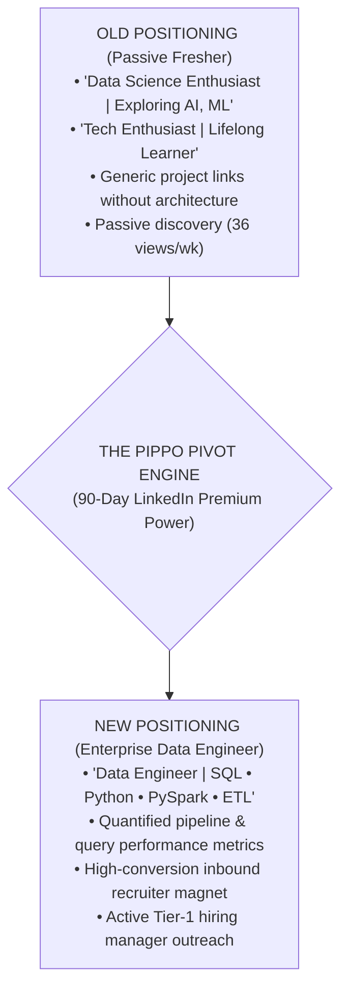
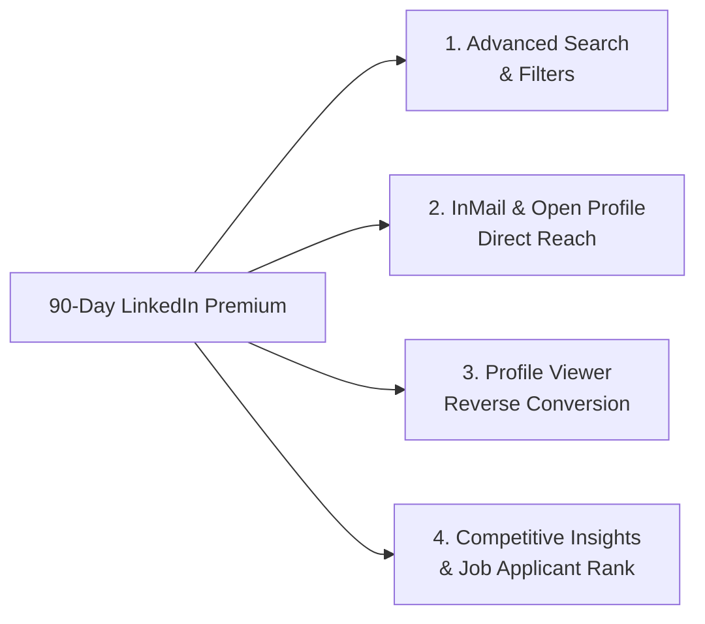

# 🚀 LINKEDIN PROFILE REDESIGN & 90-DAY PREMIUM EXECUTION BLUEPRINT
## 🎯 TARGET: TIER-1 DATA ENGINEER (25+ LPA) | MNC & PRODUCT COMPANY NETWORKING

**Candidate:** Arpit Manoj Bangre (Cap)  
**Current Network:** ~392 Connections | 399 Followers | Active LinkedIn Premium (90 Days Active Window)  
**Company Kept:** PrimaThink Technologies Pvt. Ltd. (Pivoted to Data Engineer)  
**Target Locations:** Pune, Bengaluru, Hyderabad, Mumbai, Remote  
**Strategic Co-Pilot:** Pippo 🐥  

---

## 🗺️ EXECUTIVE SUMMARY: THE 180-DEGREE DE POSITIONING PIVOT



---

## 🏛️ PART 1: COMPLETE COPY-PASTE PROFILE ASSETS

### 1. 🏷️ HEADLINE OPTIONS (Choose Option 1 for Maximum Recruiter SEO)

#### Option 1: Direct Enterprise Recruiter Keyword Magnet (RECOMMENDED)
```text
Data Engineer | SQL (Joins, Window Functions, Optimization) | Python | ETL & Data Pipelines | Data Modeling & Warehousing | Building Scalable Data Architectures
```

#### Option 2: Pipeline & Performance Focused (High Impact)
```text
Data Engineer @ PrimaThink Technologies | SQL • Python • ETL Pipelines • Relational Architecture | Reducing Query Latency from Hours to Minutes
```

#### Option 3: Modern Data Stack & Cloud Transition
```text
Data Engineer | SQL & Database Architecture • Python (Pandas/NumPy) • Automated Data Pipelines • Data Warehousing & Analytics Engineering
```

---

### 2. 📝 ABOUT SECTION (100% Copy-Paste Ready)

```text
I am a Data Engineer with a strong foundation in Computer Science and Statistics, passionate about designing, building, and optimizing scalable data ingestion pipelines and high-performance relational architectures.

At PrimaThink Technologies, I build automated ETL/ELT pipelines and optimize enterprise SQL workflows across large-scale multi-city datasets. My work focuses on transforming messy transactional data into clean, validated, analytics-ready models, eliminating manual preprocessing, and driving high-throughput reporting systems.

⚡ Core Engineering Impact:
• Query & Pipeline Optimization: Refactored complex multi-table SQL queries using CTEs, window functions, and indexing strategies—slashing reporting turnaround times from hours to minutes.
• Automated ETL Ingestion: Engineered automated data-cleaning and transformation workflows that reduced manual data preprocessing efforts by 30%.
• Schema Architecture & Data Quality: Designed normalized relational data models and integrity constraints across marketing, campaign, and transactional datasets spanning 8+ major cities.
• Analytical Engineering: Developed interactive executive dashboards tracking 10+ operational and business KPIs, supporting a 15% improvement in campaign ROI.

🛠️ Technical Stack & Core Competencies:
• Database & Query Engines: MS SQL Server, MySQL, PostgreSQL, ANSI SQL (Advanced Joins, CTEs, Window Functions, Indexing, Execution Plans).
• Languages & Processing: Python (OOP, Pandas, NumPy), PySpark (In Progress), ETL Architecture.
• Data Warehousing & Modeling: Star Schema, Snowflake & dbt (Master Course Trainee), Relational Normalization.
• Analytics & BI: Power BI, KPI Dashboards, Exploratory Data Analysis, Statistical Hypothesis Testing.
• Tools & Version Control: Git, GitHub, SSMS, VS Code, Linux CLI.

Currently expanding deep expertise into distributed big data architectures (PySpark, Delta Lake, Snowflake, and Apache Airflow) through an intensive 200-day engineering sprint.

Open to full-time Data Engineer, Associate Data Engineer, and Analytics Engineer opportunities at fast-growing product companies and tier-1 MNCs.

📫 Connect with me or reach out at: arpitbangre.work@gmail.com | Portfolio: arpitbangre.vercel.app
```

---

### 3. 💼 EXPERIENCE SECTION (Updated for PrimaThink Technologies)

**Job Title:** Data Engineer (or *Data Engineering Intern / Associate Data Engineer*)  
**Company:** PrimaThink Technologies Pvt. Ltd.  
**Employment Type:** Internship (or Full-time)  
**Location:** Nagpur, Maharashtra, India · Remote  
**Dates:** Jul 2025 – Present  

```text
• Architected and deployed automated ETL ingestion pipelines using Python and SQL to extract, clean, and transform multi-city campaign and transactional data spanning 8+ metropolitan regions.
• Optimized enterprise SQL queries, relational joins, CTEs, and window functions on large transactional databases, reducing reporting pipeline latency from hours to minutes.
• Designed and enforced relational schema constraints (PK, FK, CHECK, UNIQUE, NOT NULL), eliminating dirty data anomalies and improving staging table reliability.
• Reduced manual data preprocessing overhead by 30% through modular Python data-cleansing scripts and automated validation routines.
• Engineered centralized analytical data models and Power BI reporting layers tracking 10+ business KPIs, contributing directly to a 15% increase in campaign ROI.
• Collaborated with cross-functional product and analytics teams to translate raw business requirements into robust, production-grade data pipelines.
```

**Associated Skills:** SQL Server, Python, ETL Pipelines, Data Modeling, Query Optimization, Power BI, Git.

---

### 4. 🌟 FEATURED SECTION (Mini Data Engineering Showroom)

Arrange your Featured cards in this exact priority order:

1. **Card 1: Personal Data Engineering Portfolio & Live Dashboard**
   - *Title:* Arpit Bangre — Data Engineer Portfolio & Live Course Ecosystem
   - *Link:* `https://arpitbangre.vercel.app/`
   - *Description:* Live centralized engineering dashboard showcasing production SQL pipelines, daily commit streaks, and automated system architecture.

2. **Card 2: Mini SQL Query Engine from Scratch (Pure Python)**
   - *Title:* CLI-Based Relational Query Engine (Python)
   - *Description:* Engineered an in-memory SQL parsing and execution engine in pure Python supporting `SELECT`, `WHERE` filtering, `GROUP BY`, and custom sorting algorithms without external database dependencies.

3. **Card 3: Enterprise SQL Architecture & Multi-Table Relational Projects**
   - *Title:* Production SQL Pipelines & Schema Architecture Repository
   - *Link:* GitHub Repository link
   - *Description:* Modular SQL repository featuring HR payroll engines, e-commerce transaction auditing, temporal financial analytics, and parent-child constraint testing.

4. **Card 4: NYC Taxi Statistical & High-Volume Data Analysis**
   - *Title:* NYC Taxi Data Pipeline & Statistical Inference Engine
   - *Description:* Processed ~80,000 trip records using Python, regression modeling, and hypothesis testing to isolate true fare drivers from confounding trip variables.

---

### 5. 🎯 SKILLS SECTION (Top 10 Pinning Hierarchy)

Reorder your 36 skills so recruiters see pure Data Engineering keywords first:

**Top 3 Pinned Skills (Visible immediately):**
1. **SQL (Structured Query Language)**
2. **Data Engineering**
3. **Python (Programming Language)**

**Next Top Skills (4 to 15):**
4. ETL (Extract, Transform, Load)
5. Database Architecture & Data Modeling
6. Relational Database Management Systems (RDBMS)
7. Query Optimization & Performance Tuning
8. Microsoft SQL Server / SSMS
9. Power BI / Business Intelligence
10. Data Pipelines
11. Pandas & NumPy
12. Statistical Data Analysis
13. Git & GitHub Actions
14. Data Warehousing Fundamentals
15. MySQL / PostgreSQL

---

## ⚡ PART 2: 90-DAY LINKEDIN PREMIUM STRATEGY ENGINE

Having **90 Days of LinkedIn Premium** gives you unfair visibility advantages if executed methodically.



### 1. 🔍 Precision Boolean Search Strings (Find Decision Makers)

Use Premium search filters to find hiring managers directly. Paste these exact strings in LinkedIn search:

#### Target 1: Data Engineering Hiring Managers (Pune / BLR / HYD)
```text
("Engineering Manager" OR "Lead Data Engineer" OR "Data Engineering Manager" OR "Director of Data") AND ("Data Engineer" OR "ETL" OR "Data Platform") AND ("Pune" OR "Bengaluru" OR "Hyderabad")
```

#### Target 2: Technical Recruiters & Talent Acquisition (Tier-1 MNCs)
```text
("Technical Recruiter" OR "Talent Acquisition" OR "Data Recruiter") AND ("Data Engineer" OR "Big Data" OR "SQL") AND ("Hiring" OR "Looking for")
```

---

### 2. 📬 High-Conversion Outreach & InMail Scripts (Zero Cringe)

> [!IMPORTANT]
> **Rule of Outreach:** Never ask "Sir please give me job/referral". Always lead with technical specificity, mutual connection, and a crisp value statement.

#### Template A: Direct Connection Request (For Senior Data Engineers / Tech Leads)
```text
Hi [Name], I came across your data engineering work at [Company]. I'm a Data Engineer working with Python, SQL query optimization, and automated ETL pipelines, currently scaling into distributed systems (Spark/Snowflake). 

Would love to connect and follow your engineering insights!
```

#### Template B: InMail to Technical Recruiter (For Active Job Openings)
```text
Hi [Name],

I noticed you are leading talent acquisition for Data Engineering roles at [Company]. 

I am a Data Engineer with hands-on experience building automated ETL ingestion pipelines, optimizing complex SQL queries (reducing latency from hours to minutes), and modeling relational data architectures at PrimaThink Technologies.

Given [Company]'s focus on scalable data infrastructure, I'd love to explore how my technical background in SQL, Python, and pipeline automation aligns with your team's open DE positions.

Portfolio & Live Projects: arpitbangre.vercel.app
GitHub: github.com/arpit-m-bangre

Best regards,
Arpit Bangre
```

#### Template C: The "Reverse-Conversion" Message (When Someone Views Your Profile)
```text
Hi [Name], noticed you stopped by my profile! I saw you lead data engineering initiatives at [Company]. 

I'm currently showcasing my production SQL architectures and automated ETL pipeline work at arpitbangre.vercel.app. Would be glad to connect and stay in touch regarding future data engineering opportunities on your team.
```

---

### 3. 🗓️ 90-DAY SPRINT ROADMAP (Week-by-Week Execution)

| Phase | Timeline | Target Action | Weekly KPI |
| :--- | :--- | :--- | :--- |
| **Phase 1: Foundation Overhaul** | **Weeks 1 – 2** | • Update Headline, About, Experience & Featured.<br>• Reorder top skills & enable "Open to Work" (Recruiters Only).<br>• Turn on **Open Profile** setting. | 100% Profile Completion, 0 generic words. |
| **Phase 2: Target Network Expansion** | **Weeks 3 – 6** | • Send 20 tailored connection requests per day to DEs in Pune/BLR/HYD.<br>• Connect with alumni from Shivaji Science College in tech.<br>• Engage with 5 technical DE posts daily. | +150 Quality DE Connections / month. |
| **Phase 3: High-Visibility Inbound Posting** | **Weeks 7 – 10** | • Publish 3 high-yield posts per week (SQL query traps, ETL lessons, project architecture).<br>• Tag relevant tech tools and share GitHub code snippets. | > 1,000 weekly impressions, 50+ profile views. |
| **Phase 4: Direct InMail Recruiter Blitz** | **Weeks 11 – 12** | • Deploy 15 Premium InMails to hiring managers at target Tier-1 companies (Barclays, Citi, BNY, Snowflake, Siemens, Mastercard).<br>• Convert warm chats into interview screening calls. | 3-5 Recruiter Screening Calls. |

---

## 📣 PART 3: 3x PER WEEK CONTENT CADENCE (Aligned with Course Brain)

To maximize your LinkedIn reach, publish on **Monday, Wednesday, and Saturday**:

1. **Monday (SQL / Data Pipeline Deep Dive):**
   - *Example Hook:* "Why a comma equi-join can crash your production database if you forget one WHERE clause..." (From Day 17 Joins lesson).
2. **Wednesday (ETL / Engineering Project Architecture):**
   - *Example Hook:* "How we reduced data preprocessing time by 30% using modular Python automation..." (From PrimaThink experience).
3. **Saturday (Weekly Learning / Book Review):**
   - *Example Hook:* "5 SQL indexing traps every Data Engineer must know before a Tier-1 technical interview..." (From Vikas Ahlawat 800+ questions guide).

---

## 🏆 THE NORTH STAR AUDIT CHECKLIST

- [ ] Headline changed to **Data Engineer** keyword stack.
- [ ] About section updated with 4 quantified impact bullets.
- [ ] PrimaThink Technologies role updated to **Data Engineer** with pipeline bullets.
- [ ] Featured section loaded with Portfolio, Mini SQL Engine, and SQL repository.
- [ ] Top 3 skills pinned: **SQL, Data Engineering, Python**.
- [ ] "Open Profile" enabled under LinkedIn Premium settings.
- [ ] 20 connection requests sent daily to Data Engineers in Pune / BLR / HYD.
