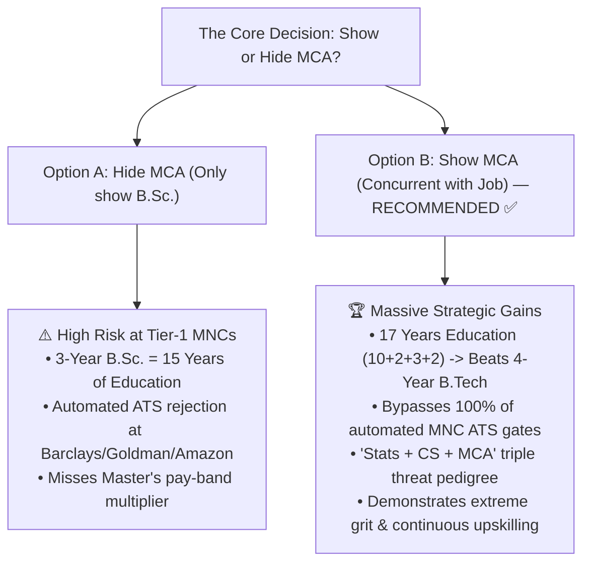

# 🎓 MCA & WORK EXPERIENCE CONCURRENT MANAGEMENT STRATEGY
## 🎯 HOW TO POSITION YOUR CONCURRENT MCA & PRIMATHINK DATA ENGINEER EXPERIENCE FOR 25+ LPA TIER-1 ROLES

**Candidate:** Arpit Manoj Bangre (Cap)  
**Co-Pilot:** Pippo 🐥  
**Education:** B.Sc. (Stats, CS & Math) [May 2025] $\rightarrow$ MCA (In Progress) [2025 – 2027]  
**Institution:** Shri Shivaji Science College, Nagpur  
**Current Role:** Data Engineer at PrimaThink Technologies Pvt. Ltd. (June 2025 – Present)  
**Target:** 25+ LPA Senior/Lead Data Engineer at Tier-1 MNCs & Product Giants  

---

## 🗺️ STRATEGIC EXECUTIVE SUMMARY: SHOW VS HIDE



---

## 🏛️ PART 1: THE 4 MAJOR ADVANTAGES OF SHOWING YOUR MCA

### 1. The 16-Year Education Rule Bypass (Critical for Tier-1 MNCs)
- **The Problem:** Global Investment Banks and US Tech GCCs (e.g. *Barclays, Goldman Sachs, Morgan Stanley, Amazon, Microsoft, Citi*) often have automated HR Applicant Tracking System (ATS) filters requiring **16 years of formal education** (10+2+4 like B.Tech/B.E.). A 3-year B.Sc. (15 years) can occasionally trigger automated filtration.
- **The Solution:** Listing your **MCA (Expected 2027)** gives you **17 years of formal education (10+2+3+2)**. You immediately satisfy and exceed all formal educational gates, putting you on equal or superior footing to B.Tech/M.Tech candidates!

### 2. The "Statistics + Computer Science + Master's" Triple Threat
- Hiring managers at top product firms look for two things in Data Engineers:
  1. **Algorithmic & Systems Engineering:** Master's level Computer Science (MCA).
  2. **Mathematical & Statistical Rigor:** B.Sc. in Statistics and Mathematics.
- Most engineers have only one. Having both makes you an elite candidate for high-salary data platform, analytics engineering, and ML infrastructure roles.

### 3. Higher Pay-Band & Job Level Eligibility
- At companies like *TCS Digital, Infosys Power Programmer, Accenture Advanced Tech, Siemens, and BNY Mellon*, candidates with a Master's degree (MCA) qualify for higher starting pay brackets and faster senior band promotions than 3-year bachelor holders.

### 4. Demonstrates High Agency & Extreme Work Ethic
- Concurrently delivering production data pipelines at work while earning a Master's degree signals **relentless ambition, discipline, and high energy**—traits hiring managers look for in top 1% talent.

---

## ⚠️ PART 2: POTENTIAL PROBLEMS, RISKS & HOW TO SOLVE THEM

| Potential Concern | Is it a Real Problem? | The Exact Solution & Mitigation Protocol |
| :--- | :---: | :--- |
| **1. Background Verification (BGV) Conflict** | ❌ NO | BGV agencies (First Advantage, AuthBridge, HireRight) check two independent components: (1) Employment authenticity via payslips, offer letter, Form 16/tax, and HR email, and (2) University accreditation and genuine marksheet. Both PrimaThink and Shivaji Science College are 100% legitimate. |
| **2. "Is concurrent job + regular college allowed?"** | ❌ NO | Remote/hybrid work and flexible college attendance with HOD approval is completely legal and widespread across the tech industry. |
| **3. Interviewer asking about time management** | 🟡 MANAGEABLE | Handled cleanly using our tailored 30-second interview script (provided in Part 4). |
| **4. Moonlighting / Dual Employment Flags** | ❌ NO | Dual employment only applies when working **two simultaneous corporate jobs with overlapping PF/UAN accounts**. Studying in college while working has zero PF overlap. |

---

## 📝 PART 3: EXACT FORMATTING TEMPLATES FOR RESUME, LINKEDIN & PORTALS

### 1. 📄 On Your Resume:

```text
EDUCATION

Master of Computer Applications (MCA) — Computer Science        Expected June 2027
Shri Shivaji Science College, Nagpur
• Relevant Focus: Advanced Database Architectures, Distributed Systems, Software Engineering

Bachelor of Science (B.Sc.) in Computer Science & Statistics           Aug 2022 – May 2025
Shri Shivaji Science College, Nagpur | Grade: A (Distinction)
• Triple Major: Computer Science, Mathematical Statistics, Mathematics
• Activities: Statistical Society Member, Event Organizer
```

---

### 2. 🌐 On Your LinkedIn Profile:

#### Education Entry 1 (MCA):
- **School:** Shri Shivaji Science College, Nagpur
- **Degree:** Master of Computer Applications - MCA
- **Field of Study:** Computer Science & Data Systems
- **Dates:** `2025 – 2027`
- **Description:** Advanced study in relational databases, distributed systems, and software engineering.

#### Education Entry 2 (B.Sc.):
- **School:** Shri Shivaji Science College, Nagpur
- **Degree:** Bachelor of Science - B.Sc.
- **Field of Study:** Computer Science and Statistics
- **Dates:** `2022 – 2025`
- **Grade:** Grade A (Distinction)

---

### 3. 💼 On Job Portals (Naukri, LinkedIn Jobs, Indeed):
- **Highest Qualification:** Select **"MCA / Master's"** $\rightarrow$ Status: **"Pursuing / In Progress"** $\rightarrow$ Year of Passing: **2027**.
- **Graduation:** Select **"B.Sc. (Computer Science / Statistics)"** $\rightarrow$ Year of Passing: **2025**.

---

## 🎙️ PART 4: INTERVIEW SCRIPTS & Q&A PLAYBOOK

### Scenario 1: The HR Screening Call
**HR Question:** *"I see you are pursuing your MCA and also working at PrimaThink. How does that work?"*

**Your Confident Script:**
> *"Yes, exactly! I completed my B.Sc. in Statistics and Computer Science in May 2025 and immediately joined PrimaThink as a Data Engineer where I work remotely on our ETL pipelines. To formalize my advanced software engineering credentials, I am concurrently completing my MCA. My college has granted me flexible attendance arrangements so I only visit for semester examinations, allowing me to be 100% dedicated to my engineering deliverables during work hours."*

---

### Scenario 2: The Technical Round / Hiring Manager
**Manager Question:** *"Why did you choose to do an MCA after a B.Sc. instead of just working?"*

**Your Engineering-First Script:**
> *"My B.Sc. gave me a deep foundation in mathematical statistics, probability distributions, and algorithmic reasoning. However, because I am targeting large-scale distributed data engineering and enterprise architectures, I wanted to combine my statistical foundation with advanced Master's-level Computer Science principles. Pursuing my MCA while writing production SQL and pipeline code gives me the perfect bridge between deep theoretical concepts and real-world system execution."*

---

## 🛡️ PART 5: 4-POINT DOCUMENTATION & BGV SAFETY CHECKLIST

Keep these 4 items organized in your personal career records for 100% stress-free documentation:

- [ ] **PrimaThink Employment Proofs:** Maintain all monthly payslips, official offer letter, internship/employment agreement, and official company email communication.
- [ ] **College Examination Records:** Keep B.Sc. final degree certificate & marksheet safe; keep MCA semester admit cards and fee receipts organized.
- [ ] **Remote/Flexible Agreement:** Ensure your working hours with PrimaThink are clear (remote/flexible deliverables) so there is never a physical location conflict on paper.
- [ ] **Single PF / UAN Account:** Ensure you only have your single active PF account from your employer.

---

## 🏆 THE FINAL VERDICT

Your concurrent MCA + Data Engineer profile is a **superpower, not a liability**:
- **B.Sc. (Stats & CS):** Proves you understand the data science math & algorithms.
- **MCA (In Progress):** Proves you have Master's level software engineering depth and clears all Tier-1 MNC 16-year education ATS filters.
- **PrimaThink Experience:** Proves you write production SQL, build ETL pipelines, and deliver real business impact.

**Stand tall, display both proudly, and let your code do the talking, Cap!** 🚀
