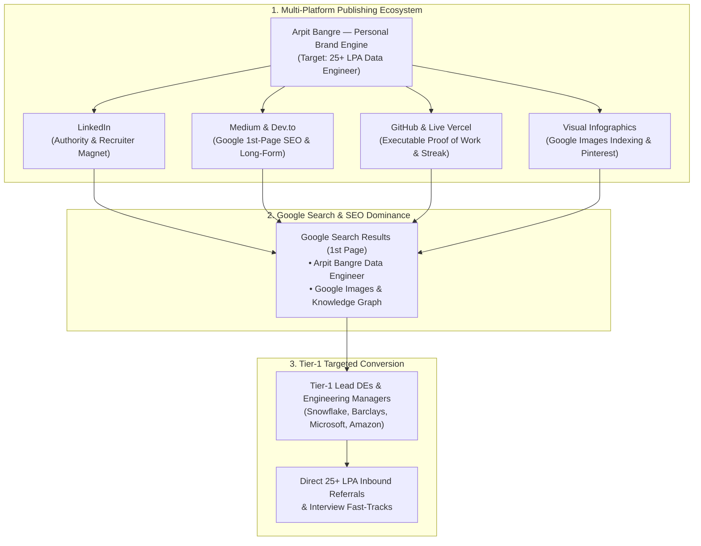
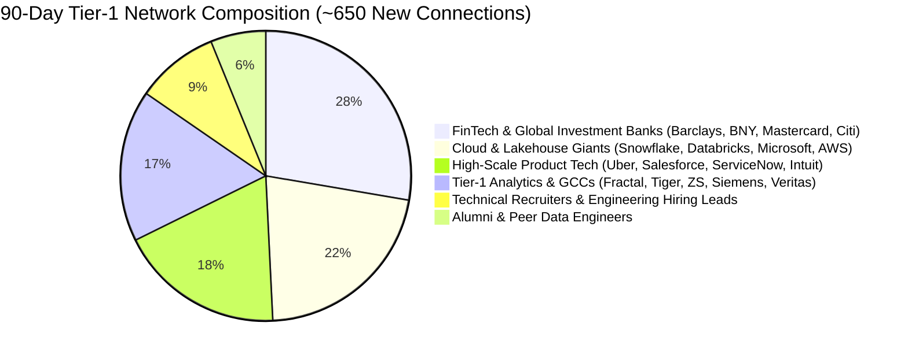
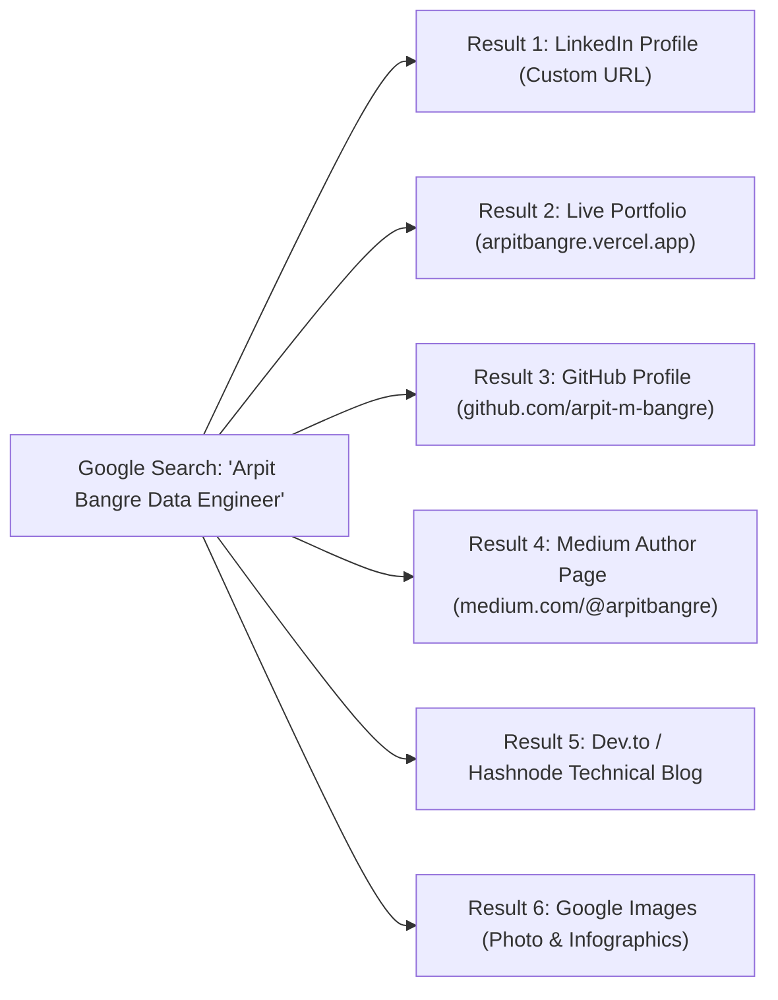
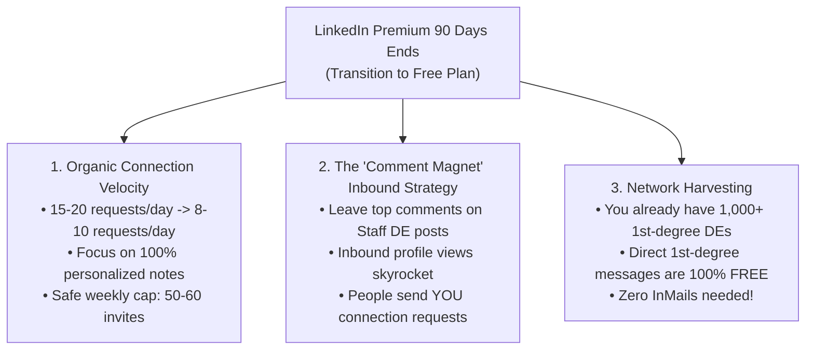

# 🏛️ TIER-1 COMPANY TARGETED NETWORKING, MULTI-PLATFORM SEO & BLOGGING ENGINE
## 🎯 TARGET: TIER-1 DATA ENGINEER (25+ LPA) | GOOGLE 1ST-PAGE SEARCH DOMINATION & POST-PREMIUM PLAYBOOK

**Architect:** Arpit Manoj Bangre (Cap)  
**Co-Pilot:** Pippo 🐥  
**Companion Directory:** [TOP_TIER_DATA_ENGINEERING_COMPANIES_HIRING_GUIDE.md](./TOP_TIER_DATA_ENGINEERING_COMPANIES_HIRING_GUIDE.md) | [GOAL.md](./GOAL.md)  
**Target Hubs:** Pune | Bengaluru | Hyderabad | Mumbai | Remote  

---

## 🗺️ THE 360-DEGREE DIGITAL AUTHORITY ARCHITECTURE



---

## 📊 PART 1: 90-DAY LINKEDIN TARGET STATE & CONNECTION PROJECTION

By executing our safe daily velocity of **12–15 targeted connection requests/day** paired with the **#90DaysOfDataEngineering** series:

### 📈 Overall Growth Scorecard
| Metric | Day 0 (Current) | Day 90 Target State | Growth Multiplier |
| :--- | :---: | :---: | :---: |
| **Total Connections** | **392** | **1,000 – 1,150+** | **~2.8x (Crosses 1k Milestone 🏆)** |
| **Total Followers** | **399** | **1,300 – 1,600+** | **~3.5x Organic Reach** |
| **Weekly Profile Views** | **36 / week** | **200 – 350+ / week** | **~8x Recruiter Inbound Traffic** |
| **Weekly Search Appearances** | **16 / week** | **120 – 200+ / week** | **~10x SEO Optimization** |
| **Total Published Technical Posts** | 7 total | **90 Daily Deep-Dives** | Complete Enterprise Portfolio |
| **Cumulative Post Impressions** | ~1,800 | **25,000 – 45,000+** | High Domain Authority |

### 🏢 Company-Wise Distribution (~650 New Tier-1 Connections):


| Company Cluster | Specific Target Companies | Target Connections at Day 90 | Key Titles Connected With |
| :--- | :--- | :---: | :--- |
| **Global FinTech & Banks** *(Pune, BLR, Mumbai)* | **Barclays, BNY Mellon, Mastercard, Deutsche Bank, JPMorgan, Morgan Stanley, Citi** | **160 – 190** | • Lead Data Engineer<br>• Senior ETL / SQL Architect<br>• VP / AVP of Data Engineering |
| **Cloud & Lakehouse Leaders** *(Pune, BLR, HYD)* | **Snowflake, Databricks, Microsoft, Amazon / AWS, Google, Oracle (OCI)** | **130 – 150** | • Data Platform Lead<br>• Senior Big Data Engineer<br>• Snowflake / Spark Architect |
| **High-Scale Product Tech** *(BLR, HYD, Pune)* | **Uber, Salesforce, Atlassian, ServiceNow, Intuit, Adobe, Cisco, VMware** | **110 – 130** | • Staff Data Engineer<br>• Pipeline / Lakehouse Lead<br>• Engineering Manager |
| **Tier-1 Analytics & GCC Hubs** *(Pune, BLR, Gurgaon)* | **Fractal Analytics, Tiger Analytics, Siemens, Veritas, NVIDIA, ZS Associates** | **90 – 110** | • Principal Analytics Engineer<br>• Big Data Consultant<br>• Tech Lead |
| **Technical Talent Acquisition** | **Recruiters from the above Tier-1 firms** | **50 – 70** | • Senior Technical Recruiter<br>• Lead Talent Partner (Data & Cloud) |

---

## 🌐 PART 2: MULTI-PLATFORM BLOGGING & DIGITAL FOOTPRINT ECOSYSTEM

Do not limit your voice to LinkedIn. Cross-post the same core content across high-authority platforms to build an unshakeable digital footprint:

| Platform | Primary Purpose | How to Use It | Ranking Power |
| :--- | :--- | :--- | :---: |
| **1. LinkedIn** | Recruiter networking, B2B visibility, peer discussion | Publish daily 2-minute micro-deep dives (#90DaysOfDataEngineering) | 🔴 Immediate |
| **2. Medium** | Long-form technical blogs, high Google search ranking | Convert every 5 daily posts into 1 comprehensive weekly master article | ⭐⭐⭐⭐⭐ (SEO 96) |
| **3. Dev.to / Hashnode** | Global software developer community & canonical backlinks | Publish markdown tutorials with code snippets; links back to your portfolio | ⭐⭐⭐⭐⭐ (SEO 92) |
| **4. GitHub Readme & Repos** | Code proof-of-work, commit streak, open-source portfolio | Host all daily SQL scripts, project code, and system architecture docs | ⭐⭐⭐⭐⭐ (SEO 98) |
| **5. Substack** | Personal tech newsletter (*"The Scalable Data Engineer"*) | Weekly digest sent directly to subscribers, establishing personal brand equity | ⭐⭐⭐⭐ |
| **6. X / Twitter (#DataTwitter)** | Quick 1-tweet SQL traps, architecture diagrams, tagging tech founders | Share 3-tweet threads breaking down database internals and Spark tuning | ⭐⭐⭐⭐ |
| **7. Pinterest / Slideshare** | Visual infographics, SQL cheatsheets, relational architecture diagrams | Upload high-resolution architecture diagrams for instant Google Image indexing | ⭐⭐⭐⭐⭐ (Images) |

---

## 🔍 PART 3: GOOGLE 1ST-PAGE SEARCH & IMAGE DOMINANCE STRATEGY

When a recruiter searches **"Arpit Bangre"** or **"Arpit Bangre Data Engineer"**, we want the entire Google 1st Page (Top 10 results and Google Images) to be 100% owned by your professional assets.



### 🎯 5 Actionable Steps to Rank on Google Search:

#### 1. Custom Public URL Standardization
Ensure your username/slug is identical across all platforms:
- LinkedIn: `linkedin.com/in/arpitmbangre`
- GitHub: `github.com/arpit-m-bangre`
- Medium: `medium.com/@arpitmbangre`
- Portfolio: `arpitbangre.vercel.app`

#### 2. Image SEO Optimization (How to rank your photo on Google Images)
Google does not "see" images; it reads **file names**, **alt text**, and **contextual metadata**:
- **Rename your profile photo file before uploading:**  
  ❌ `IMG_20260820_091234.jpg`  
  ✅ `arpit-bangre-data-engineer-pune.jpg`
- **Always provide descriptive Alt-Text:**  
  `alt="Arpit Bangre - Enterprise Data Engineer & Database Architect"`
- **Setup Gravatar (Globally Recognized Avatar):**  
  Create an account at [Gravatar.com](https://gravatar.com) using your primary email (`arpitbangre.work@gmail.com`) and upload your professional photo. Gravatar syncs your photo to GitHub, Medium, WordPress, and developer platforms, accelerating Google image indexing.

#### 3. Structured Data / Schema.org on Portfolio
Your portfolio website (`arpitbangre.vercel.app`) contains Schema.org `Person` metadata:
```json
{
  "@context": "https://schema.org",
  "@type": "Person",
  "name": "Arpit Bangre",
  "jobTitle": "Data Engineer",
  "url": "https://arpitbangre.vercel.app",
  "sameAs": [
    "https://www.linkedin.com/in/arpitmbangre/",
    "https://github.com/arpit-m-bangre"
  ]
}
```

#### 4. Document & Notes Sharing Platforms (High Google Authority)
Upload your clean PDF notes (e.g. [PDF_READING_GUIDE.md](file:///d:/DE%20COURSE/01_SQL/01_CLASS_NOTES/Questions/PDF_READING_GUIDE.md), SQL Master Cheatsheet):
- **SlideShare / Scribd / SpeakerDeck:** Title: *"SQL Query Optimization & Relational Architecture Notes by Arpit Bangre"*. (Google indexes PDFs on SlideShare within 48 hours).
- **Notion Public Page:** Create a public Notion page *"Arpit Bangre — Data Engineering Knowledge Hub"*.

---

## 🔒 PART 4: POST-90 DAYS PLAYBOOK (HOW TO THRIVE ON LINKEDIN FREE)

When your 90-day LinkedIn Premium ends, **your profile will NOT lose momentum if you follow this organic protocol**:



### 🛡️ 4 Rules for Lifelong Account Safety & High Performance:
1. **Pacing on Free Plan:** Send **8 to 10 personalized connection requests per day** (Max 50/week). The free plan has stricter weekly limits, so focus on 100% precision.
2. **The "Top Comment" Inbound Strategy:**
   - Follow 20 top Data Engineering creators (e.g. Zach Wilson, SeattleDataGuy, Joe Reis, Alex Wang).
   - Set post notifications on. Within 15 minutes of their post, write an insightful 3-line architectural comment.
   - Top comments get 10,000+ views, driving 20-30 incoming connection requests to your profile daily without you sending a single invite!
3. **Weekly Cleanup Maintenance:** Every Sunday, withdraw pending sent invitations older than 2 weeks to keep your pending pool under 100.
4. **Security & 2FA:** Turn on Two-Factor Authentication (2FA) and verify your phone number. This prevents automated security lockouts.

---

## 📑 PART 5: 5 READY-TO-PUBLISH MASTER BLOGS (REFINED FOR ALL PLATFORMS)

### 📘 Blog 1: The Cartesian Join Memory Explosion (Targeting: Snowflake, Databricks, AWS DEs)
*(Cross-post to LinkedIn, Medium & Dev.to)*

```text
Why an accidental CROSS JOIN can crash your data warehouse:

When joining dimension tables to fact tables, a missing join predicate doesn't just return wrong data—it creates an exponential Cartesian explosion.

Consider 3 tables:
• Customers: 10,000 rows
• Products: 5,000 rows
• Orders: 1,000,000 rows

If a junior pipeline engineer writes:
SELECT * FROM Customers, Products, Orders WHERE Customers.id = Orders.cust_id;

Notice what happened? Products has NO join condition!
Instead of a clean 1M row joined dataset, the query engine multiplies:
1,000,000 x 5,000 = 5 BILLION intermediate rows.

In distributed engines like Spark or Snowflake:
❌ Severe memory spill to disk
❌ Out-Of-Memory (OOM) executor kill
❌ Massive warehouse credit consumption

The Fix:
Always enforce ANSI SQL-92 `INNER JOIN ... ON` syntax. The SQL compiler will throw an immediate syntax error if the ON predicate is omitted, preventing silent Cartesian runaway disasters.

How does your team guard against unindexed join blowups in production ETL?

#DataEngineering #SQL #Snowflake #BigData #DatabaseArchitecture
```

---

### 📘 Blog 2: The Foreign Key Retrofitting Dilemma (Targeting: Barclays, BNY Mellon, Mastercard DEs)

```text
How do you retrofit a FOREIGN KEY constraint on a 50-million-row live table without downtime?

In legacy banking systems, tables often start without strict foreign key constraints. But as the system scales, referential integrity becomes non-negotiable.

Simply running:
ALTER TABLE Transactions ADD CONSTRAINT fk_account FOREIGN KEY (account_id) REFERENCES Accounts(account_id);
will fail with Error 547 if even a SINGLE orphan row exists.

Here is the 4-step production migration playbook I use:

Step 1: Detect Orphan Records (Anti-Join)
SELECT t.trans_id, t.account_id
FROM Transactions t
LEFT JOIN Accounts a ON t.account_id = a.account_id
WHERE a.account_id IS NULL;

Step 2: Quarantine or Remap Dirty Keys
UPDATE Transactions 
SET account_id = 999999 -- Central Default Ghost Account
WHERE account_id NOT IN (SELECT account_id FROM Accounts);

Step 3: Add Constraint with `WITH NOCHECK` (Instant metadata lock, zero table scan lock)
ALTER TABLE Transactions WITH NOCHECK 
ADD CONSTRAINT fk_account FOREIGN KEY (account_id) REFERENCES Accounts(account_id);

Step 4: Enable Constraint for Future Inserts
ALTER TABLE Transactions CHECK CONSTRAINT fk_account;

Result: 100% referential integrity enforced moving forward with zero production read/write lock contention.

Data Engineers in FinTech: How do you handle schema migrations on high-velocity transactional databases?

#DataEngineering #SQLServer #FinTech #DatabaseInternals #ETL
```

---

### 📘 Blog 3: SARGability & Query Performance Tuning (Targeting: Microsoft, Amazon, Oracle DEs)

```text
Writing `WHERE YEAR(OrderDate) = 2026` is quietly killing your database query performance.

Here is why:

When you wrap an indexed column in a function like `YEAR()`, `MONTH()`, or `SUBSTRING()`:
1. The query optimizer CANNOT use the B-Tree index to perform an **Index Seek**.
2. It is forced to evaluate the function row-by-row across millions of pages, triggering a catastrophic **Full Index Scan** or **Table Scan**.

This is called making your query NON-SARGable (Not Search Argument Able).

❌ Non-SARGable (Full Table Scan across 10M rows):
SELECT OrderID, Amount 
FROM Orders 
WHERE YEAR(OrderDate) = 2026;

✅ SARGable Equivalent (Sub-millisecond Index Seek):
SELECT OrderID, Amount 
FROM Orders 
WHERE OrderDate >= '2026-01-01' AND OrderDate < '2027-01-01';

Result:
• Logical Reads: Reduced from 45,000 pages -> 12 pages.
• Execution Time: Slashed from 4.2 seconds -> 18 milliseconds.

Small syntactic habits make the difference between an unscalable script and an enterprise data engine.

#DataEngineering #SQLPerformance #QueryOptimization #Indexing #DatabaseDesign
```

---

### 📘 Blog 4: The 3-Valued Logic (3VL) Join Trap (Targeting: Google, Atlassian, ServiceNow DEs)

```text
Why `NULL = NULL` is UNKNOWN—and how it silently drops rows in Relational Joins:

In SQL, `NULL` does not represent a value; it represents the absence of data (unknown state).

Because of SQL's Three-Valued Logic (TRUE, FALSE, UNKNOWN):
• `5 = 5` -> TRUE
• `5 = NULL` -> UNKNOWN
• `NULL = NULL` -> UNKNOWN (NOT TRUE!)

The Consequence in INNER JOINs:
If Table A has `id = NULL` and Table B has `id = NULL`, an `INNER JOIN ON A.id = B.id` will NEVER match them. Both rows are silently excluded.

The Consequence in Set Theory (`INTERSECT`):
Set operators treat NULLs as equal for distinct matching purposes! `INTERSECT` will keep the NULL record.

Understanding the mathematical distinction between horizontal relational joins and vertical set operations is one of the most critical fundamentals for senior data architects.

Have you ever encountered unexpected data loss due to NULL join keys in staging pipelines?

#DataEngineering #SQL #RelationalTheory #DataQuality #DatabaseArchitecture
```

---

### 📘 Blog 5: Automated Data Pipeline Validation (Targeting: Uber, Salesforce, Intuit DEs)

```text
A data pipeline without automated validation is just a silent bug generator.

When ingesting multi-city campaign data across 8+ regions at PrimaThink Technologies, dirty data anomalies (NULL customer IDs, negative transaction amounts, future order dates) used to cause manual reprocessing bottlenecks.

We implemented an automated 3-tier validation layer directly into the ingestion pipeline:

1. Structural Validation (Schema & Types): Reject malformed JSON/CSV payloads at the landing zone.
2. Relational Integrity Validation: Check foreign key existence in master dimension tables before loading into the warehouse.
3. Business Metric Sanity Rules: Assert constraints (e.g. `DeliveryDate >= OrderDate`, `Amount > 0`).

Outcome:
• 30% reduction in manual data preprocessing.
• Zero downstream dashboard recalculation errors.
• Slashing reporting latency from hours to minutes.

How does your team enforce automated data contract testing before pushing to production lakehouses?

#DataEngineering #ETL #DataQuality #Python #DataPipelines #AnalyticsEngineering
```

---

## 🏆 DAILY 30-MINUTE EXECUTION TIMELINE

- **09:30 AM (10 mins):** Publish today's blog on LinkedIn & Medium (copy-pasting the daily concept).
- **01:30 PM (10 mins):** Send 6-8 tailored connection requests to Tier-1 DEs with the matching reference note.
- **08:30 PM (10 mins):** Leave 2 top comments on leading creators' posts and withdraw pending invites older than 14 days every Sunday.

**Zero distraction from your core 7-hour study grind. 100% compounding authority.** 🚀
