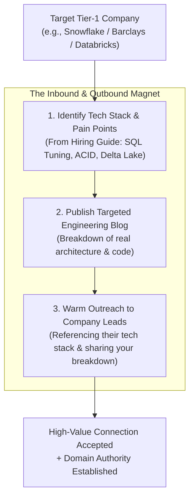

# 🏛️ TIER-1 COMPANY TARGETED NETWORKING & ENGINEERING BLOGGING ENGINE
## 🎯 CONNECTING WITH LEADERS AT MICROSOFT, AMAZON, SNOWFLAKE, DATABRICKS, BARCLAYS, BNY MELLON & MASTERCARD

**Architect:** Arpit Manoj Bangre (Cap)  
**Co-Pilot:** Pippo 🐥  
**Companion Directory:** [TOP_TIER_DATA_ENGINEERING_COMPANIES_HIRING_GUIDE.md](./TOP_TIER_DATA_ENGINEERING_COMPANIES_HIRING_GUIDE.md)  
**Target Hubs:** Pune | Bengaluru | Hyderabad | Mumbai | Remote  

---

## 🗺️ THE 3-PILLAR TARGETED ATTRACTION ENGINE



---

## 🏢 PART 1: TIER-1 COMPANY CLUSTERS & WHAT THEY CARE ABOUT

To get noticed by Senior/Lead Data Engineers at top companies, your blogs and messages must speak their exact technical dialect:

| Target Company Cluster | Companies | What Their Engineering Teams Care About | High-Impact Blog Topic That Hooks Them |
| :--- | :--- | :--- | :--- |
| **Cluster A: Cloud & Lakehouse Giants** | **Snowflake, Databricks, Microsoft, AWS** | • Columnar storage vs Row-oriented<br>• Micro-partitioning & Pruning<br>• Spark shuffle optimization<br>• ACID lakehouse transactions | *"Why Cartesian Joins Crash Spark Clusters: Visualizing Shuffling and Memory Spill"* |
| **Cluster B: Global FinTech & Investment Banks** | **Barclays, BNY Mellon, Mastercard, Deutsche Bank, JPMorgan** | • Zero data-loss transactional integrity<br>• Constraint retrofitting on live tables<br>• High-precision financial math<br>• Audit trail logging & temporal data | *"Retrofitting Foreign Keys on a 50M-Row Populated Financial Ledger without Table Locks"* |
| **Cluster C: High-Scale Product Platforms** | **Uber, Salesforce, Intuit, ServiceNow, Atlassian** | • Sub-second analytical queries<br>• Star Schema vs Snowflake Schema<br>• Idempotent ETL pipeline retries<br>• Index fragmentation & SARGability | *"Why Function Wrapping in WHERE Clauses Destroys Index Seeks: A Deep Dive into SARGability"* |

---

## ✍️ PART 2: THE "TIER-1 ENGINEERING BLOG" WRITING FORMULA

Generic LinkedIn posts get scrolled past. **Engineering Case-Study Blogs** get shared, bookmarked, and commented on by Staff Engineers.

### The 5-Part High-Authority Post Structure:

```text
[1. THE CONTRARIAN HOOK (1-2 lines)]
Most engineers think X is true. In high-scale production systems, it actually causes Y.

[2. THE ARCHITECTURAL BOTTLENECK / SCENARIO (3-4 lines)]
Explain a real enterprise scenario (e.g. 100M rows, query latency spiking to 45 mins, broken foreign key constraints).

[3. THE ENGINEERING SOLUTION & CODE (Clean SQL / Python / ASCII diagram)]
Provide the precise, optimized SQL/Python logic with clear comments.

[4. THE MEASURABLE OUTCOME (Metrics)]
Result: Execution time dropped from 45 mins -> 12 seconds; memory overhead slashed by 60%.

[5. THE ARCHITECTURAL LESSON & INVITATION TO DISCUSS]
What is the core takeaway for Data Engineers? End with an open technical question.
```

---

## 📑 PART 3: 5 READY-TO-PUBLISH MASTER BLOGS (COPY & TWEAK)

### 📘 Blog 1: The Cartesian Join Memory Explosion (Targeting: Snowflake, Databricks, AWS DEs)

```text
Why an accidental CROSS JOIN can crash your data warehouse:

When joining dimension tables to fact tables, a missing join predicate doesn't just return wrong data—it creates an exponential Cartesian explosion.

Consider 3 tables:
• Customers: 10,000 rows
• Products: 5,000 rows
• Orders: 1,000,000 rows

If a junior pipeline engineer writes:
SELECT * FROM Customers, Products, Orders WHERE Customers.id = Orders.cust_id;

Notice what happened? Products has NO join condition!
Instead of a clean 1M row joined dataset, the query engine multiplies:
1,000,000 x 5,000 = 5 BILLION intermediate rows.

In distributed engines like Spark or Snowflake:
❌ Severe memory spill to disk
❌ Out-Of-Memory (OOM) executor kill
❌ Massive warehouse credit consumption

The Fix:
Always enforce ANSI SQL-92 `INNER JOIN ... ON` syntax. The SQL compiler will throw an immediate syntax error if the ON predicate is omitted, preventing silent Cartesian runaway disasters.

How does your team guard against unindexed join blowups in production ETL?

#DataEngineering #SQL #Snowflake #BigData #DatabaseArchitecture
```

---

### 📘 Blog 2: The Foreign Key Retrofitting Dilemma (Targeting: Barclays, BNY Mellon, Mastercard DEs)

```text
How do you retrofit a FOREIGN KEY constraint on a 50-million-row live table without downtime?

In legacy banking systems, tables often start without strict foreign key constraints. But as the system scales, referential integrity becomes non-negotiable.

Simply running:
ALTER TABLE Transactions ADD CONSTRAINT fk_account FOREIGN KEY (account_id) REFERENCES Accounts(account_id);
will fail with Error 547 if even a SINGLE orphan row exists.

Here is the 4-step production migration playbook I use:

Step 1: Detect Orphan Records (Anti-Join)
SELECT t.trans_id, t.account_id
FROM Transactions t
LEFT JOIN Accounts a ON t.account_id = a.account_id
WHERE a.account_id IS NULL;

Step 2: Quarantine or Remap Dirty Keys
UPDATE Transactions 
SET account_id = 999999 -- Central Default Ghost Account
WHERE account_id NOT IN (SELECT account_id FROM Accounts);

Step 3: Add Constraint with `WITH NOCHECK` (Instant metadata lock, zero table scan lock)
ALTER TABLE Transactions WITH NOCHECK 
ADD CONSTRAINT fk_account FOREIGN KEY (account_id) REFERENCES Accounts(account_id);

Step 4: Enable Constraint for Future Inserts
ALTER TABLE Transactions CHECK CONSTRAINT fk_account;

Result: 100% referential integrity enforced moving forward with zero production read/write lock contention.

Data Engineers in FinTech: How do you handle schema migrations on high-velocity transactional databases?

#DataEngineering #SQLServer #FinTech #DatabaseInternals #ETL
```

---

### 📘 Blog 3: SARGability & Query Performance Tuning (Targeting: Microsoft, Amazon, Oracle DEs)

```text
Writing `WHERE YEAR(OrderDate) = 2026` is quietly killing your database query performance.

Here is why:

When you wrap an indexed column in a function like `YEAR()`, `MONTH()`, or `SUBSTRING()`:
1. The query optimizer CANNOT use the B-Tree index to perform an **Index Seek**.
2. It is forced to evaluate the function row-by-row across millions of pages, triggering a catastrophic **Full Index Scan** or **Table Scan**.

This is called making your query NON-SARGable (Not Search Argument Able).

❌ Non-SARGable (Full Table Scan across 10M rows):
SELECT OrderID, Amount 
FROM Orders 
WHERE YEAR(OrderDate) = 2026;

✅ SARGable Equivalent (Sub-millisecond Index Seek):
SELECT OrderID, Amount 
FROM Orders 
WHERE OrderDate >= '2026-01-01' AND OrderDate < '2027-01-01';

Result:
• Logical Reads: Reduced from 45,000 pages -> 12 pages.
• Execution Time: Slashed from 4.2 seconds -> 18 milliseconds.

Small syntactic habits make the difference between an unscalable script and an enterprise data engine.

#DataEngineering #SQLPerformance #QueryOptimization #Indexing #DatabaseDesign
```

---

### 📘 Blog 4: The 3-Valued Logic (3VL) Join Trap (Targeting: Google, Atlassian, ServiceNow DEs)

```text
Why `NULL = NULL` is UNKNOWN—and how it silently drops rows in Relational Joins:

In SQL, `NULL` does not represent a value; it represents the absence of data (unknown state).

Because of SQL's Three-Valued Logic (TRUE, FALSE, UNKNOWN):
• `5 = 5` -> TRUE
• `5 = NULL` -> UNKNOWN
• `NULL = NULL` -> UNKNOWN (NOT TRUE!)

The Consequence in INNER JOINs:
If Table A has `id = NULL` and Table B has `id = NULL`, an `INNER JOIN ON A.id = B.id` will NEVER match them. Both rows are silently excluded.

The Consequence in Set Theory (`INTERSECT`):
Set operators treat NULLs as equal for distinct matching purposes! `INTERSECT` will keep the NULL record.

Understanding the mathematical distinction between horizontal relational joins and vertical set operations is one of the most critical fundamentals for senior data architects.

Have you ever encountered unexpected data loss due to NULL join keys in staging pipelines?

#DataEngineering #SQL #RelationalTheory #DataQuality #DatabaseArchitecture
```

---

### 📘 Blog 5: Automated Data Pipeline Validation (Targeting: Uber, Salesforce, Intuit DEs)

```text
A data pipeline without automated validation is just a silent bug generator.

When ingesting multi-city campaign data across 8+ regions at PrimaThink Technologies, dirty data anomalies (NULL customer IDs, negative transaction amounts, future order dates) used to cause manual reprocessing bottlenecks.

We implemented an automated 3-tier validation layer directly into the ingestion pipeline:

1. Structural Validation (Schema & Types): Reject malformed JSON/CSV payloads at the landing zone.
2. Relational Integrity Validation: Check foreign key existence in master dimension tables before loading into the warehouse.
3. Business Metric Sanity Rules: Assert constraints (e.g. `DeliveryDate >= OrderDate`, `Amount > 0`).

Outcome:
• 30% reduction in manual data preprocessing.
• Zero downstream dashboard recalculation errors.
• Slashing reporting latency from hours to minutes.

How does your team enforce automated data contract testing before pushing to production lakehouses?

#DataEngineering #ETL #DataQuality #Python #DataPipelines #AnalyticsEngineering
```

---

## 🎯 PART 4: TARGETED COMPANY OUTREACH TEMPLATES (LINKED TO BLOGS)

When you send a connection request after publishing one of these blogs, reference the exact topic:

### Template for Senior / Lead DEs at Snowflake / Databricks:
```text
Hi [Name], saw your leadership in data platforms at [Company]. I recently published a breakdown on avoiding Cartesian runaway explosions and memory spills in distributed join engines. Would love to connect and follow your engineering work!
```

### Template for Tech Leads at Barclays / BNY Mellon / Mastercard:
```text
Hi [Name], really admire the scale of [Company]'s financial data infrastructure in [Pune/BLR]. I've been writing about foreign key retrofitting and zero-lock schema migrations on high-velocity transactional databases. Glad to connect and learn from your journey!
```

### Template for Engineering Managers at Microsoft / AWS / Google:
```text
Hi [Name], I've been following [Company]'s technical publications around scalable cloud data architectures. As a Data Engineer focused on SQL query optimization, SARGability, and automated pipeline validation, I'd be honored to connect with you!
```

---

## 📈 WEEKLY EXECUTION CADENCE

1. **Publish Blog:** Every Monday, Wednesday, and Saturday morning at **09:30 AM IST** (Peak recruiter & tech lead LinkedIn scrolling time).
2. **Send 5-7 Targeted Connection Requests:** To engineers at the specific company matching that day's blog theme.
3. **Engage with Their Posts:** Leave 2-3 insightful technical comments on target leaders' posts every evening.
