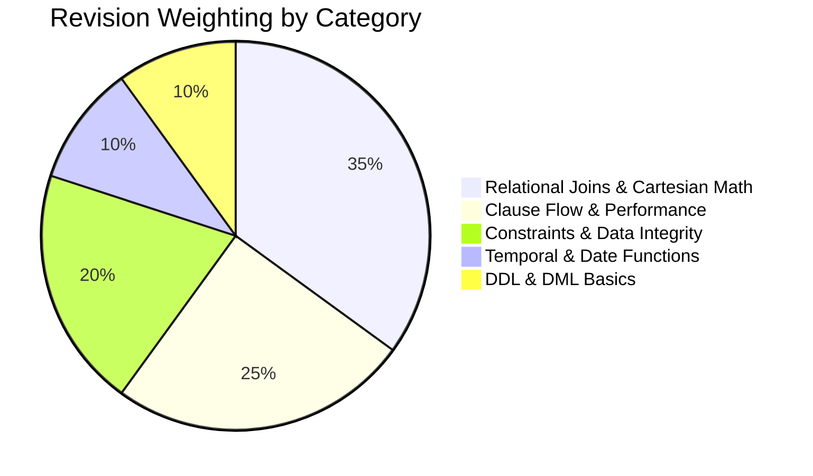

# 🔁 DYNAMIC REVISION RECOMMENDER ENGINE & INTELLIGENT RETRIEVAL SYSTEM
*(Spaced Repetition Schedule • Priority Matrix • Weak-Spot Auto-Targeting • Formula Bank)*

This recommender engine combines **Spaced Repetition Principles**, **Automated Weak-Spot Detection**, and **Interview Frequency Weighting** to provide a clear, prioritized revision blueprint.

---

## 🧭 SPACED REPETITION CADENCE & CYCLE LOGIC

| Interval Stage | Target Timeline | Learning Activity | Target Output Artifact |
| :--- | :--- | :--- | :--- |
| **Interval 1: Immediate** | Same Day (Class Night) | Note re-write + 7-Step Interactive Revision | [03_REVISION_NOTES/](file:///d:/DE%20COURSE/01_SQL/03_REVISION_NOTES/) |
| **Interval 2: Day + 1** | Next Morning / Sprint 1 | Solve 14-Question Drills + Class Tasks | [05_INDEX_WISE_QUESTIONS/](file:///d:/DE%20COURSE/01_SQL/05_INDEX_WISE_QUESTIONS/) & [04_CLASS_TASKS/](file:///d:/DE%20COURSE/01_SQL/04_CLASS_TASKS/) |
| **Interval 3: Day + 3** | Mid-Week Catchup | Error Trap Diagnostic & Bug Resolution | [CONCEPT_MASTERY_HEATMAP.md](file:///d:/DE%20COURSE/LEARNING_DIARY/CONCEPT_MASTERY_HEATMAP.md) |
| **Interval 4: Day + 7** | Weekly Milestone | Enterprise Pipeline Project Execution | [06_PROJECTS/](file:///d:/DE%20COURSE/01_SQL/06_PROJECTS/) |
| **Interval 5: Day + 14 / Pre-Interview** | Fortnightly Sprint | Rapid Recall Drill & Formula Verification | [REVISION_RECOMMENDER_ENGINE.md](file:///d:/DE%20COURSE/LEARNING_DIARY/REVISION_RECOMMENDER_ENGINE.md) |

---

## 🔴 TIER 1: HIGH-PRIORITY REVISION QUEUE (ACTIVE WEAK SPOTS & HIGH-PROBABILITY TRAPS)

### 1. Topic: Column Property (`NOT NULL`) vs Table Constraint Syntax
- **Priority**: 🔴 CRITICAL (Active Exam Trap - Q6 Offline Test)
- **Reason**: Common syntax confusion in live coding rounds. `NOT NULL` is a column modification, NOT an `ADD CONSTRAINT`.
- **Target File**: [2026-08-13_REVISION.md](file:///d:/DE%20COURSE/01_SQL/03_REVISION_NOTES/2026-08-13_REVISION.md)
- **Executable Syntax Comparison**:
  ```sql
  -- Column Property Modification:
  ALTER TABLE Employee ALTER COLUMN salary DECIMAL(10,2) NOT NULL;
  
  -- Table-Level Constraint Addition:
  ALTER TABLE Employee ADD CONSTRAINT pk_employee_id PRIMARY KEY (emp_id);
  ```

### 2. Topic: Transactional `TRUNCATE` Rollback Mechanics
- **Priority**: 🔴 CRITICAL (Active Exam Trap - Q12 Offline Test)
- **Reason**: 90% of candidates believe TRUNCATE cannot be rolled back. In SQL Server, inside an explicit transaction block, it DOES rollback.
- **Target File**: [2026-08-13_REVISION.md](file:///d:/DE%20COURSE/01_SQL/03_REVISION_NOTES/2026-08-13_REVISION.md)
- **Executable Proof Block**:
  ```sql
  BEGIN TRANSACTION;
      TRUNCATE TABLE Employee; -- Deallocates pages; metadata logged
  ROLLBACK; -- 100% of data restored in SQL Server!
  ```

### 3. Topic: 6-Stage Logical Query Execution Flow & Alias Scope
- **Priority**: 🔴 CRITICAL (Fundamental Engine Architecture)
- **Reason**: Explains why `WHERE` cannot access column aliases and why `HAVING` filters post-aggregation.
- **Target File**: [2026-08-07_REVISION.md](file:///d:/DE%20COURSE/01_SQL/03_REVISION_NOTES/2026-08-07_REVISION.md)
- **Engine Execution Pipeline**:
  ```
  [1] FROM & JOIN  ==>  [2] WHERE  ==>  [3] GROUP BY  ==>  [4] HAVING  ==>  [5] SELECT  ==>  [6] ORDER BY
  ```

### 4. Topic: Relational Joins, Cartesian Products & NULL Matching Behavior
- **Priority**: 🔴 CRITICAL (Core Data Engineering Pillar - Days 15 & 16)
- **Reason**: Join frequency multiplier math ($N \times M$), String Literal `'NULL'` vs SQL keyword `NULL`, and anti-join syntax.
- **Target Files**: [2026-08-18_REVISION.md](file:///d:/DE%20COURSE/01_SQL/03_REVISION_NOTES/2026-08-18_REVISION.md) & [2026-08-19_REVISION.md](file:///d:/DE%20COURSE/01_SQL/03_REVISION_NOTES/2026-08-19_REVISION.md)
- **Anti-Join Pattern (Left Anti-Join)**:
  ```sql
  -- Customers who have NEVER placed an order:
  SELECT c.custid, c.custname
  FROM Customers AS c
  LEFT JOIN Orders AS o
      ON c.custid = o.custid
  WHERE o.custid IS NULL;
  ```

---

## 🟡 TIER 2: MEDIUM-PRIORITY REVISION QUEUE (MAINTENANCE & EDGE-CASE SYNTAX)

| Day / Date | Topic Focus | Key Mechanics & Edge Cases | Review Target |
| :--- | :--- | :--- | :--- |
| **Day 2 & 3** | Pattern Matching & LIKE Wildcards | `%` (any length), `_` (single char), `[A-Z]` (character range), `[^A-Z]` (negation) | [2026-08-02_REVISION.md](file:///d:/DE%20COURSE/01_SQL/03_REVISION_NOTES/2026-08-02_REVISION.md) |
| **Day 6** | NULL Handling in Aggregates | `COUNT(*)` counts NULLs, `AVG(col)` silently ignores NULLs | [2026-08-06_REVISION.md](file:///d:/DE%20COURSE/01_SQL/03_REVISION_NOTES/2026-08-06_REVISION.md) |
| **Day 10** | `IDENTITY` & Seed/Step Management | `IDENTITY(seed, increment)`, `DBCC CHECKIDENT`, explicit insertion via `SET IDENTITY_INSERT` | [2026-08-10_REVISION.md](file:///d:/DE%20COURSE/01_SQL/03_REVISION_NOTES/2026-08-10_REVISION.md) |
| **Day 11** | Referential Integrity & Table Destruction | Cannot DROP parent table while Foreign Key references exist; must DROP child first or DROP FK constraint | [2026-08-11_REVISION.md](file:///d:/DE%20COURSE/01_SQL/03_REVISION_NOTES/2026-08-11_REVISION.md) |
| **Day 14** | Temporal Functions & Boundary Math | `DATEDIFF(datepart, start, end)` counts boundary crossings; `DATEADD` and `EOMONTH` leap year handling | [2026-08-17_REVISION.md](file:///d:/DE%20COURSE/01_SQL/03_REVISION_NOTES/2026-08-17_REVISION.md) |

---

## 🟢 TIER 3: LOW-PRIORITY REVISION QUEUE (STABLE FOUNDATIONS)

- **SQL Command Taxonomy (DDL, DML, DQL, DCL, TCL)**: Review [2026-08-01_REVISION.md](file:///d:/DE%20COURSE/01_SQL/03_REVISION_NOTES/2026-08-01_REVISION.md)
- **Computed Column Expressions & Arithmetic Aliases**: Review [2026-08-04_REVISION.md](file:///d:/DE%20COURSE/01_SQL/03_REVISION_NOTES/2026-08-04_REVISION.md)
- **Stored Object Renaming via `sp_rename`**: Review [2026-08-05_REVISION.md](file:///d:/DE%20COURSE/01_SQL/03_REVISION_NOTES/2026-08-05_REVISION.md)

---

## 📐 RAPID-RECALL ROW COUNT FORMULA MATRIX (TIER-1 INTERVIEWS)

```
========================================================================================
1. InnerMatch(k)          = Count_T1(k) * Count_T2(k)    (where k != SQL NULL)
2. Count(INNER JOIN)      = Sum of InnerMatch(k) across all matching keys k
3. Count(LEFT JOIN)       = Count(INNER JOIN) + Count(Unmatched Rows in Table 1)
4. Count(RIGHT JOIN)      = Count(INNER JOIN) + Count(Unmatched Rows in Table 2)
5. Count(FULL OUTER JOIN) = Count(INNER JOIN) + Unmatched_T1 + Unmatched_T2
6. Count(CROSS JOIN)      = TotalRows(Table 1) * TotalRows(Table 2)
========================================================================================
```

---

## 🎯 WEEKLY REVISION SPRINT ALLOCATION


