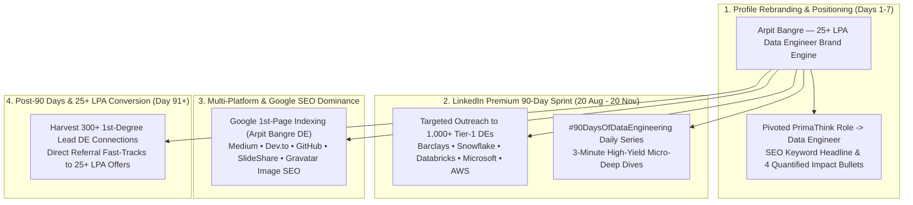
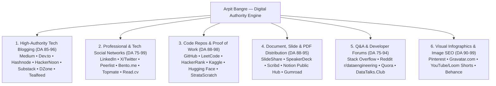

# 🏛️ TIER-1 DATA ENGINEERING HIRING, NETWORKING & 360° SOCIAL BRANDING MASTER PLAN
## 🎯 TARGET: 25+ LPA DATA ENGINEER | 90-DAY LINKEDIN PREMIUM (20 AUG – 20 NOV 2026) | GOOGLE 1ST-PAGE SEARCH DOMINANCE

**Candidate & Brand:** Arpit Manoj Bangre (Cap)  
**Lead AI Mentor & Strategist:** Pippo 🐥  
**LinkedIn Premium Active Window:** **20 August 2026 — 20 November 2026 (90 Days Active)**  
**Core Strategy:** **Zero Job Applications for 90 Days** — 100% Inbound Authority, Tier-1 MNC Peer Networking, Multi-Platform Syndication & Google Search Domination  
**Target Hubs:** Pune | Bengaluru | Hyderabad | Delhi-NCR | Mumbai | Remote  
**Interactive Web Showcase:** [digital_presence_ecosystem.html](./digital_presence_ecosystem.html)  

---

## 🗺️ MASTER ARCHITECTURAL ROADMAP



---

## 💰 PART 1: SALARY BENCHMARKS & 60+ TIER-1 COMPANIES DIRECTORY

### 1. Indian Market Compensation Brackets (Base + Bonus + Stocks)
| Career Level | Experience Range | Tier-1 Product / Big Tech / FinTech | Tier-1 GCC / Global Hubs | High-Growth Tech / Unicorns | Elite Pure-Play Analytics |
| :--- | :--- | :--- | :--- | :--- | :--- |
| **Data Engineer I (Trainee / Associate)** | 0 – 2 Years | **₹12 LPA – ₹26 LPA** | **₹8 LPA – ₹16 LPA** | **₹10 LPA – ₹22 LPA** | **₹6.5 LPA – ₹12 LPA** |
| **Data Engineer II (Mid-Level)** | 2 – 5 Years | **₹24 LPA – ₹48 LPA** | **₹18 LPA – ₹32 LPA** | **₹20 LPA – ₹40 LPA** | **₹14 LPA – ₹24 LPA** |
| **Senior Data Engineer / Tech Lead** | 5 – 9 Years | **₹45 LPA – ₹85+ LPA** | **₹32 LPA – ₹55 LPA** | **₹38 LPA – ₹70 LPA** | **₹24 LPA – ₹42 LPA** |
| **Staff / Principal Data Architect** | 9+ Years | **₹80 LPA – ₹1.5+ Cr** | **₹55 LPA – ₹95 LPA** | **₹65 LPA – ₹1.2 Cr** | **₹40 LPA – ₹70 LPA** |

---

### 2. Comprehensive Directory of 60+ Target Tier-1 Companies

#### 🏛️ Category A: Big Tech, Cloud Giants & Platform Providers
- **Microsoft** (Azure Synapse, Fabric, CosmosDB, PySpark, T-SQL) — *Bengaluru, Hyderabad, Pune, Noida*
- **Amazon / AWS** (EMR, Redshift, Glue, Athena, PySpark, Python) — *Bengaluru, Hyderabad, Pune, Chennai*
- **Google** (BigQuery, Dataflow, Apache Beam, Bigtable, Python) — *Bengaluru, Hyderabad, Pune, Gurgaon*
- **Snowflake** (Snowflake Core, Snowpark, SQL, Columnar Architecture) — *Bengaluru, Pune, Hyderabad*
- **Databricks** (Delta Lake, Apache Spark, PySpark, Unity Catalog) — *Bengaluru, Hyderabad*
- **Salesforce** (Big Data, Spark, Kafka, Presto, HBase) — *Bengaluru, Hyderabad, Pune*
- **Uber** (Apache Hudi, Kafka, Flink, Spark, Presto) — *Bengaluru, Hyderabad*
- **Atlassian** (AWS, Spark, Kafka, Presto, Databricks, PostgreSQL) — *Bengaluru*
- **Adobe** (Spark, Kafka, Hadoop, AWS/Azure, Python, Presto) — *Bengaluru, Noida*
- **Oracle (OCI)** (OCI Data Lake, Autonomous DB, GoldenGate, Spark) — *Bengaluru, Hyderabad, Pune*
- **ServiceNow** (MariaDB, Kafka, Spark, Azure, Scalable Ingestion) — *Hyderabad, Bengaluru*
- **Cisco Systems** (Snowflake, Kafka, Airflow, Spark, AWS/GCP) — *Bengaluru, Pune, Chennai*
- **VMware / Broadcom** (Spark, Presto, Trino, Kubernetes, Python) — *Bengaluru, Pune*
- **Intuit** (AWS, Databricks, Spark, Snowflake, Kafka, Python) — *Bengaluru*
- **Stripe & Twilio** (Presto, Spark, Iceberg, Flink, ClickHouse) — *Bengaluru*

#### 💳 Category B: Global Investment Banks, FinTech & Quant Trading
- **Goldman Sachs** (Spark, Snowflake, Kafka, Slang, Big Data) — *Bengaluru, Hyderabad*
- **Morgan Stanley** (Spark, PySpark, Hadoop, Snowflake, DB2, Python) — *Bengaluru, Mumbai*
- **JPMorgan Chase & Co.** (AWS, Snowflake, Spark, Cassandra, Kafka, SQL) — *Bengaluru, Hyderabad, Mumbai, Pune*
- **D.E. Shaw & Co. & Tower Research** (High-Speed SQL, Python, Low Latency Streams) — *Hyderabad, Gurugram*
- **Barclays** (SQL Server, Oracle, PySpark, AWS, Kafka, Snowflake) — *Pune, Bengaluru, Chennai*
- **Deutsche Bank** (Oracle, PostgreSQL, Spark, GCP, Kafka, Airflow) — *Pune, Bengaluru, Mumbai*
- **Mastercard & Visa** (Oracle, Postgres, Snowflake, Spark, Kafka, Presto) — *Pune, Gurugram, Bengaluru, Mumbai*
- **American Express (AmEx)** (Big Data, Spark, Hive, Snowflake, Python, SQL) — *Gurugram, Bengaluru, Chennai*
- **BNY Mellon** (Oracle, Snowflake, Spark, PySpark, AWS/Azure) — *Pune, Bengaluru, Chennai*
- **BlackRock (Aladdin Data)** (Cassandra, Spark, Snowflake, Python) — *Gurugram, Mumbai, Bengaluru*
- **PayPal & Fidelity Investments** (GCP, BigQuery, Snowflake, PySpark, Airflow) — *Bengaluru, Chennai*
- **UBS / Credit Suisse & Societe Generale** (Oracle, PostgreSQL, Azure, Spark) — *Pune, Mumbai, Bengaluru*

#### 🏢 Category C: Top Global Capability Centers (GCCs) & R&D Hubs
- **Walmart Global Tech & Target Technology** (Azure/GCP, BigQuery, Spark, Kafka, Presto, Flink) — *Bengaluru, Chennai*
- **Lowe's India & The Home Depot** (GCP, BigQuery, Databricks, PySpark, Airflow) — *Bengaluru*
- **John Deere & Mercedes-Benz R&D (MBRDI)** (AWS/Azure, Databricks, PySpark, Synapse, IoT) — *Pune, Bengaluru*
- **Bosch Global Software & Boeing India** (AWS/Azure, Spark, Kafka, Databricks, Airflow) — *Bengaluru, Pune, Chennai*
- **Shell Digital Hub & BP (British Petroleum)** (Azure/AWS, Databricks, Snowflake, PowerBI) — *Bengaluru, Pune*
- **Siemens Healthineers / Tech & Philips** (AWS, Spark, PostgreSQL, Kafka, Python) — *Bengaluru, Pune*
- **Eli Lilly & Novartis & AstraZeneca** (AWS, Databricks, Snowflake, Airflow, PySpark) — *Hyderabad, Bengaluru, Chennai*
- **Qualcomm, AMD & Applied Materials** (Big Data, Spark, Python, Linux, Custom Storage) — *Hyderabad, Bengaluru*

#### 🦄 Category D: Top High-Growth Tech Unicorns
- **Flipkart, Swiggy, Zomato/Blinkit, Zepto** (Spark, Flink, Kafka, Snowflake, ClickHouse, dbt) — *Bengaluru, Gurugram, Mumbai*
- **PhonePe & Razorpay & Cred & Groww & Zerodha** (HBase, Cassandra, Kafka, ClickHouse, Snowflake, Postgres) — *Bengaluru, Pune*
- **Meesho, Dream11, Delhivery, InMobi, Urban Company** (GCP BigQuery, Redshift, Spark, Iceberg, Presto) — *Bengaluru, Mumbai, Gurugram*

#### 📊 Category E: Elite Pure-Play Data & Analytics Firms
- **Tiger Analytics & Fractal Analytics & Tredence** (Databricks, Snowflake, PySpark, dbt, Airflow) — *Chennai, Bengaluru, Pune, Gurugram*
- **LatentView, Sigmoid, Quantiphi, Thoughtworks, Searce** (BigQuery, Spark, ClickHouse, Snowflake, Kafka) — *Bengaluru, Pune, Mumbai*

---

## 🛡️ PART 2: THE 90-DAY LINKEDIN PREMIUM ACTION WINDOW (20 AUG – 20 NOV 2026)

### 1. 🛡️ The Steel-Wall Anti-Ban & Safety Protocol
1. **ZERO Third-Party Automation Tools:** Never use *Dux-Soup, Octopus CRM, Waalaxy, PhantomBuster, or LinkedHelper*. All outreach must be 100% human and manual.
2. **Safe Daily Connection Velocity:**
   - **Weeks 1-2:** Max **10 to 12** requests/day.
   - **Weeks 3-12:** Max **15 to 20** requests/day (Max 80–100/week).
3. **The "Warm-Up" Pacing Rule:** Open profile $\rightarrow$ scroll experience $\rightarrow$ like 1 technical post $\rightarrow$ click Connect with a tailored note.
4. **Weekly Request Cleanup:** Every Sunday, withdraw pending sent requests older than 2 weeks (keep pending pool under 120).
5. **No Job Begging:** Zero "Sir please give referral". Lead with technical curiosity and shared architectural interests.

---

### 2. 🏷️ Complete 100% Copy-Paste Profile Assets

#### A. Headline (Maximum SEO Inbound Magnet):
```text
Data Engineer | SQL (Joins, Window Functions, Optimization) | Python | ETL & Data Pipelines | Relational Architecture & Warehousing | Building Scalable Data Infrastructure
```

#### B. About Section:
```text
I am a Data Engineer with a strong foundation in Computer Science and Statistics, dedicated to architecting scalable ETL ingestion pipelines, high-throughput relational databases, and clean dimensional models.

At PrimaThink Technologies, I build automated data pipelines and optimize enterprise SQL workflows across large-scale multi-city datasets. My work focuses on transforming messy transactional data into clean, validated, analytics-ready structures, eliminating manual preprocessing overhead, and accelerating reporting queries.

⚡ Core Engineering Impact:
• Query & Pipeline Optimization: Refactored complex multi-table SQL queries using CTEs, window functions, and indexing strategies—slashing reporting turnaround times from hours to minutes.
• Automated ETL Ingestion: Engineered automated data-cleaning and transformation workflows that reduced manual preprocessing efforts by 30%.
• Schema Architecture & Data Quality: Designed normalized relational data models and integrity constraints across transactional datasets spanning 8+ metropolitan regions.
• Analytical Engineering: Developed interactive executive dashboards tracking 10+ operational KPIs, supporting a 15% improvement in campaign ROI.

🛠️ Technical Stack & Core Competencies:
• Database Engines & SQL: MS SQL Server, MySQL, PostgreSQL, ANSI SQL (Advanced Joins, CTEs, Window Functions, Indexing, Execution Plans, Transaction ACID).
• Languages & Processing: Python (OOP, Pandas, NumPy), PySpark (In Progress), ETL Architecture.
• Data Warehousing & Modeling: Star Schema, Snowflake & dbt (Trainee), Relational Normalization.
• Analytics & BI: Power BI, KPI Dashboards, Exploratory Data Analysis, Statistical Hypothesis Testing.
• Tools & Version Control: Git, GitHub Actions, SSMS, VS Code, Linux CLI.

Currently executing an intensive 200-day engineering sprint covering distributed big data pipelines (PySpark, Delta Lake, Snowflake, Apache Airflow).

📫 Connect or reach out: arpitbangre.work@gmail.com | Portfolio: arpitbangre.vercel.app
```

#### C. Experience Section (PrimaThink Technologies):
**Title:** Data Engineer  
**Company:** PrimaThink Technologies Pvt. Ltd.  
**Location:** Nagpur, Maharashtra, India · Remote  
**Dates:** Jul 2025 – Present  
```text
• Architected and deployed automated ETL ingestion pipelines using Python and SQL to extract, clean, and transform multi-city campaign and transactional data spanning 8+ metropolitan regions.
• Optimized enterprise SQL queries, relational joins, CTEs, and window functions on large transactional databases, reducing reporting pipeline latency from hours to minutes.
• Designed and enforced relational schema constraints (PK, FK, CHECK, UNIQUE, NOT NULL), eliminating dirty data anomalies and improving staging table reliability.
• Reduced manual data preprocessing overhead by 30% through modular Python data-cleansing scripts and automated validation routines.
• Engineered centralized analytical data models and Power BI reporting layers tracking 10+ business KPIs, contributing directly to a 15% increase in campaign ROI.
• Collaborated with cross-functional product and analytics teams to translate raw business requirements into robust, production-grade data pipelines.
```

#### D. Top 3 Pinned Skills:
1. **SQL (Structured Query Language)**
2. **Data Engineering**
3. **Python (Programming Language)**

---

## 📊 PART 3: 90-DAY PROJECTION & 1,000+ CONNECTION TARGET STATE

| Metric | Day 0 (20 Aug 2026) | Day 90 Target (20 Nov 2026) | Multiplier |
| :--- | :---: | :---: | :---: |
| **Total Connections** | **392** | **1,000 – 1,150+** | **~2.8x (1K Milestone 🏆)** |
| **Total Followers** | **399** | **1,300 – 1,600+** | **~3.5x Organic Reach** |
| **Weekly Profile Views** | **36 / week** | **200 – 350+ / week** | **~8x Recruiter Inbound** |
| **Weekly Search Appearances** | **16 / week** | **120 – 200+ / week** | **~10x SEO Visibility** |
| **Published Technical Posts** | 7 total | **90 Daily Deep-Dives** | Full Enterprise Catalog |
| **Cumulative Impressions** | ~1,800 | **25,000 – 45,000+** | High Domain Authority |

### 🏢 Network Composition at Day 90:
- **Global FinTech & Banks (Barclays, BNY, Mastercard, Citi):** 160 – 190 connections.
- **Cloud & Lakehouse Leaders (Snowflake, Databricks, Microsoft, AWS):** 130 – 150 connections.
- **High-Scale Product Giants (Uber, Salesforce, ServiceNow, Intuit):** 110 – 130 connections.
- **Tier-1 Analytics & GCCs (Fractal, Tiger, ZS, Siemens, Veritas):** 90 – 110 connections.
- **Technical Recruiters & Talent Partners:** 50 – 70 connections.

---

## 🌐 PART 4: THE 34+ MULTI-CHANNEL DIGITAL FOOTPRINT ECOSYSTEM



### 📋 Complete Platform Roster & SEO Mapping:

1. **High-Authority Tech Blogging (Google 1st-Page SEO):**
   - **Medium (DA 96):** `medium.com/@arpitmbangre` (Weekly 1,200-word master articles; submit to *Towards Data Science* & *Data Engineer Things*).
   - **Dev.to (DA 92):** `dev.to/arpitmbangre` (Pure markdown tutorials with canonical backlinks to your portfolio).
   - **Hashnode (DA 88):** `arpitbangre.hashnode.dev` (Personal blog with GitHub auto-sync).
   - **HackerNoon (DA 89):** `hackernoon.com/u/arpitmbangre` (Architectural stories to 4M+ readers).
   - **Substack (DA 93):** `arpitbangre.substack.com` (Weekly newsletter *"The Scalable Pipeline"*).
   - **DZone (DA 86):** `dzone.com/users/arpitbangre` (Enterprise Database & Big Data zones).
   - **Tealfeed & FreeCodeCamp (DA 87):** Roadmap and SQL syndication.

2. **Professional & Developer Social Networks:**
   - **LinkedIn (DA 99):** `linkedin.com/in/arpitmbangre` (Daily #90DaysOfDataEngineering & B2B networking).
   - **X / Twitter (#DataTwitter) (DA 94):** `x.com/arpitmbangre` (3-tweet technical architecture threads).
   - **Peerlist (DA 75):** `peerlist.io/arpitbangre` (Developer network & project spotlight).
   - **Bento.me (DA 82):** `bento.me/arpitbangre` (Visual personal link-in-bio hub).
   - **Read.cv (DA 78):** `read.cv/arpitbangre` (Minimalist high-design resume).
   - **Topmate.io (DA 72):** `topmate.io/arpitbangre` (Free 15-min mentor chat slots).

3. **Code Repositories, Competitive Coding & Proof of Work:**
   - **GitHub (DA 98):** `github.com/arpit-m-bangre` (Master repo, 200-day commit streak, Profile README).
   - **LeetCode (DA 90):** `leetcode.com/arpitbangre` (Top SQL 50 study badge).
   - **HackerRank (DA 88):** `hackerrank.com/arpitbangre` (5-Star Gold badges in SQL & Python).
   - **Kaggle (DA 92):** `kaggle.com/arpitbangre` (High-volume analytical notebooks: NYC Taxi, Spotify).
   - **Hugging Face (DA 90):** `huggingface.co/arpitbangre` (Open-source datasets & ETL Python spaces).
   - **StrataScratch (DA 70):** FAANG SQL interview drills.

4. **Document, Slide & PDF Knowledge Distribution (Instant Google PDF Indexing):**
   - **SlideShare (DA 95):** `slideshare.net/arpitbangre` (Upload clean PDF study guides & SQL cheatsheets; Google indexes in 48h).
   - **Scribd (DA 94):** `scribd.com/arpitbangre` (Upload comprehensive technical roadmaps & guides).
   - **SpeakerDeck (DA 89):** `speakerdeck.com/arpitbangre` (Upload engineering presentation decks).
   - **Notion Public Hub (DA 90):** Public DE knowledge wiki.
   - **Gumroad / Payhip (DA 91):** Free downloadable digital cheatsheets ($0+).

5. **Technical Q&A & Developer Forums:**
   - **Stack Overflow (DA 94):** Answering SQL Server & Python questions under `[sql-server]`, `[joins]`.
   - **Reddit r/dataengineering (DA 92):** Engaging in real-world architecture debates.
   - **Quora (DA 93):** Answering high-search career & technical SQL questions.
   - **DataTalks.Club / dbt Slack (DA 75):** 50k+ global DE community.

6. **Visual Infographics & Google Image SEO Platforms:**
   - **Pinterest (DA 94):** Visual SQL cheatsheets & ER diagrams for Google Images ranking.
   - **Gravatar.com (DA 95):** Syncing `arpit-bangre-data-engineer.jpg` across thousands of platforms.
   - **YouTube / Loom (DA 99):** 60-second architecture video walkthroughs.
   - **Behance / Dribbble (DA 93):** Power BI dashboard and schema diagrams.

---

## 📑 PART 5: 5 READY-TO-PUBLISH MASTER BLOGS (COPY & TWEAK)

### 📘 Blog 1: The Cartesian Join Memory Explosion (Targeting: Snowflake, Databricks, AWS DEs)
```text
Why an accidental CROSS JOIN can crash your data warehouse:

When joining dimension tables to fact tables, a missing join predicate doesn't just return wrong data—it creates an exponential Cartesian explosion.

Consider 3 tables:
• Customers: 10,000 rows
• Products: 5,000 rows
• Orders: 1,000,000 rows

If a junior pipeline engineer writes:
SELECT * FROM Customers, Products, Orders WHERE Customers.id = Orders.cust_id;

Notice what happened? Products has NO join condition!
Instead of a clean 1M row joined dataset, the query engine multiplies:
1,000,000 x 5,000 = 5 BILLION intermediate rows.

In distributed engines like Spark or Snowflake:
❌ Severe memory spill to disk
❌ Out-Of-Memory (OOM) executor kill
❌ Massive warehouse credit consumption

The Fix:
Always enforce ANSI SQL-92 `INNER JOIN ... ON` syntax. The SQL compiler will throw an immediate syntax error if the ON predicate is omitted, preventing silent Cartesian runaway disasters.

How does your team guard against unindexed join blowups in production ETL?

#DataEngineering #SQL #Snowflake #BigData #DatabaseArchitecture
```

---

### 📘 Blog 2: The Foreign Key Retrofitting Dilemma (Targeting: Barclays, BNY Mellon, Mastercard DEs)
```text
How do you retrofit a FOREIGN KEY constraint on a 50-million-row live table without downtime?

In legacy banking systems, tables often start without strict foreign key constraints. But as the system scales, referential integrity becomes non-negotiable.

Simply running:
ALTER TABLE Transactions ADD CONSTRAINT fk_account FOREIGN KEY (account_id) REFERENCES Accounts(account_id);
will fail with Error 547 if even a SINGLE orphan row exists.

Here is the 4-step production migration playbook I use:

Step 1: Detect Orphan Records (Anti-Join)
SELECT t.trans_id, t.account_id
FROM Transactions t
LEFT JOIN Accounts a ON t.account_id = a.account_id
WHERE a.account_id IS NULL;

Step 2: Quarantine or Remap Dirty Keys
UPDATE Transactions 
SET account_id = 999999 -- Central Default Ghost Account
WHERE account_id NOT IN (SELECT account_id FROM Accounts);

Step 3: Add Constraint with `WITH NOCHECK` (Instant metadata lock, zero table scan lock)
ALTER TABLE Transactions WITH NOCHECK 
ADD CONSTRAINT fk_account FOREIGN KEY (account_id) REFERENCES Accounts(account_id);

Step 4: Enable Constraint for Future Inserts
ALTER TABLE Transactions CHECK CONSTRAINT fk_account;

Result: 100% referential integrity enforced moving forward with zero production read/write lock contention.

Data Engineers in FinTech: How do you handle schema migrations on high-velocity transactional databases?

#DataEngineering #SQLServer #FinTech #DatabaseInternals #ETL
```

---

### 📘 Blog 3: SARGability & Query Performance Tuning (Targeting: Microsoft, Amazon, Oracle DEs)
```text
Writing `WHERE YEAR(OrderDate) = 2026` is quietly killing your database query performance.

Here is why:

When you wrap an indexed column in a function like `YEAR()`, `MONTH()`, or `SUBSTRING()`:
1. The query optimizer CANNOT use the B-Tree index to perform an **Index Seek**.
2. It is forced to evaluate the function row-by-row across millions of pages, triggering a catastrophic **Full Index Scan** or **Table Scan**.

This is called making your query NON-SARGable (Not Search Argument Able).

❌ Non-SARGable (Full Table Scan across 10M rows):
SELECT OrderID, Amount 
FROM Orders 
WHERE YEAR(OrderDate) = 2026;

✅ SARGable Equivalent (Sub-millisecond Index Seek):
SELECT OrderID, Amount 
FROM Orders 
WHERE OrderDate >= '2026-01-01' AND OrderDate < '2027-01-01';

Result:
• Logical Reads: Reduced from 45,000 pages -> 12 pages.
• Execution Time: Slashed from 4.2 seconds -> 18 milliseconds.

Small syntactic habits make the difference between an unscalable script and an enterprise data engine.

#DataEngineering #SQLPerformance #QueryOptimization #Indexing #DatabaseDesign
```

---

### 📘 Blog 4: The 3-Valued Logic (3VL) Join Trap (Targeting: Google, Atlassian, ServiceNow DEs)
```text
Why `NULL = NULL` is UNKNOWN—and how it silently drops rows in Relational Joins:

In SQL, `NULL` does not represent a value; it represents the absence of data (unknown state).

Because of SQL's Three-Valued Logic (TRUE, FALSE, UNKNOWN):
• `5 = 5` -> TRUE
• `5 = NULL` -> UNKNOWN
• `NULL = NULL` -> UNKNOWN (NOT TRUE!)

The Consequence in INNER JOINs:
If Table A has `id = NULL` and Table B has `id = NULL`, an `INNER JOIN ON A.id = B.id` will NEVER match them. Both rows are silently excluded.

The Consequence in Set Theory (`INTERSECT`):
Set operators treat NULLs as equal for distinct matching purposes! `INTERSECT` will keep the NULL record.

Understanding the mathematical distinction between horizontal relational joins and vertical set operations is one of the most critical fundamentals for senior data architects.

Have you ever encountered unexpected data loss due to NULL join keys in staging pipelines?

#DataEngineering #SQL #RelationalTheory #DataQuality #DatabaseArchitecture
```

---

### 📘 Blog 5: Automated Data Pipeline Validation (Targeting: Uber, Salesforce, Intuit DEs)
```text
A data pipeline without automated validation is just a silent bug generator.

When ingesting multi-city campaign data across 8+ regions at PrimaThink Technologies, dirty data anomalies (NULL customer IDs, negative transaction amounts, future order dates) used to cause manual reprocessing bottlenecks.

We implemented an automated 3-tier validation layer directly into the ingestion pipeline:

1. Structural Validation (Schema & Types): Reject malformed JSON/CSV payloads at the landing zone.
2. Relational Integrity Validation: Check foreign key existence in master dimension tables before loading into the warehouse.
3. Business Metric Sanity Rules: Assert constraints (e.g. `DeliveryDate >= OrderDate`, `Amount > 0`).

Outcome:
• 30% reduction in manual data preprocessing.
• Zero downstream dashboard recalculation errors.
• Slashing reporting latency from hours to minutes.

How does your team enforce automated data contract testing before pushing to production lakehouses?

#DataEngineering #ETL #DataQuality #Python #DataPipelines #AnalyticsEngineering
```

---

## 🔍 PART 6: GOOGLE 1ST-PAGE SEARCH & IMAGE DOMINANCE STRATEGY

When a recruiter searches **"Arpit Bangre Data Engineer"**:
1. **Google Images Photo Indexing Protocol:**
   - **File Renaming:** Rename photo file before upload: `arpit-bangre-data-engineer-pune.jpg` (never upload generic `IMG_1234.jpg`).
   - **Alt-Text:** Always supply `alt="Arpit Bangre - Enterprise Data Engineer & Database Architect"`.
   - **Gravatar Setup:** Setup [Gravatar.com](https://gravatar.com) using `arpitbangre.work@gmail.com` to sync your photo across GitHub, Medium, WordPress, and developer sites.
2. **Schema.org Structured Data:**
   - Embedded `Person` JSON-LD schema on your live portfolio ([arpitbangre.vercel.app](https://arpitbangre.vercel.app/)) linking LinkedIn and GitHub profiles.

---

## 🔒 PART 7: POST-90 DAYS PLAYBOOK (HOW TO THRIVE ON LINKEDIN FREE)

When your free Premium ends on **20 November 2026**:
1. **Organic Connection Velocity:** Shift to **8–10 high-precision personalized invites/day** (Max 50/week).
2. **The "Top Comment" Inbound Magnet:** Leave early, insightful 3-line architectural comments on top creators' posts to generate **20–30 daily incoming profile views** without sending invites.
3. **Network Harvesting:** You will already be 1st-degree connected to 1,000+ Lead DEs—**direct 1st-degree messages on LinkedIn Free are 100% free and unlimited forever!**
4. **Weekly Hygiene:** Always withdraw pending sent invites older than 14 days every Sunday.

---

## 🏆 DAILY 30-MINUTE EXECUTION TIMELINE

- **09:30 AM (10 mins):** Publish today's blog on LinkedIn & Medium (copy-pasting the daily concept from DE course).
- **01:30 PM (10 mins):** Send 6-8 tailored connection requests to Tier-1 DEs with the matching reference note.
- **08:30 PM (10 mins):** Leave 2 top comments on leading creators' posts and withdraw pending invites older than 14 days every Sunday.

**Total study time impact: ZERO. 100% compounding authority for the 25+ LPA goal!** 🚀
